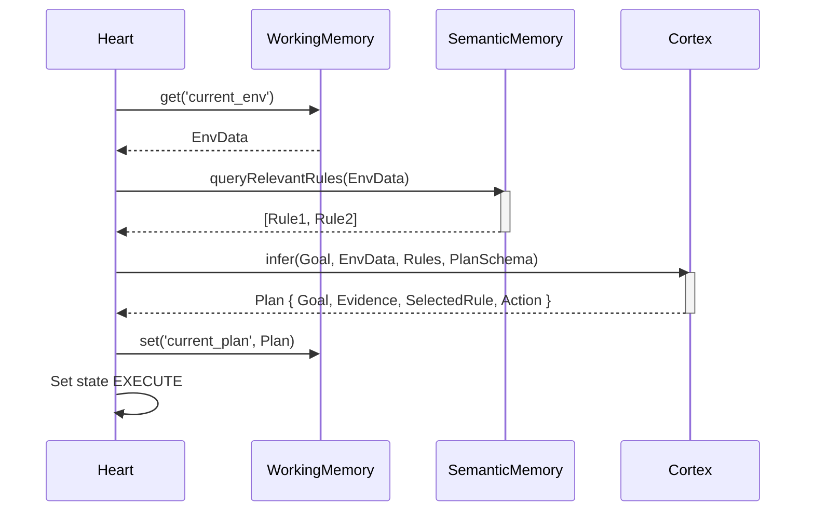
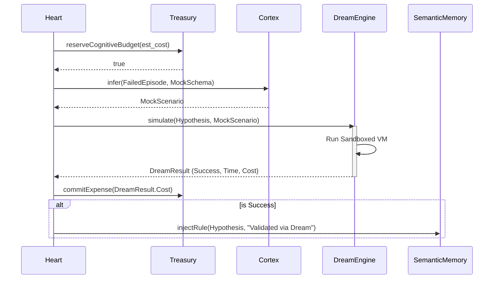
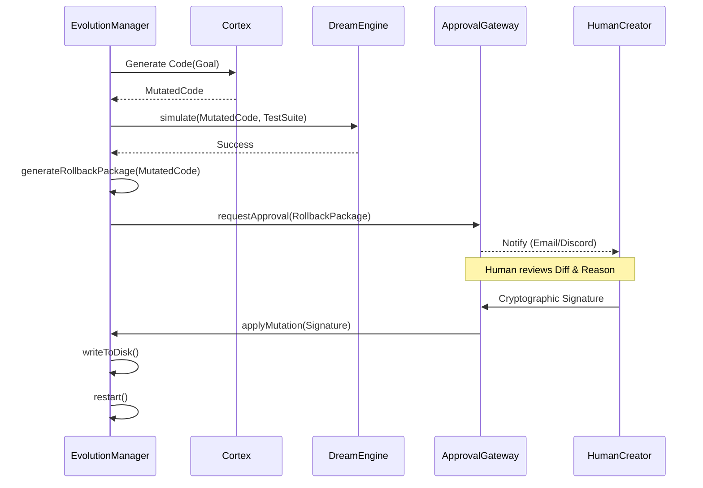
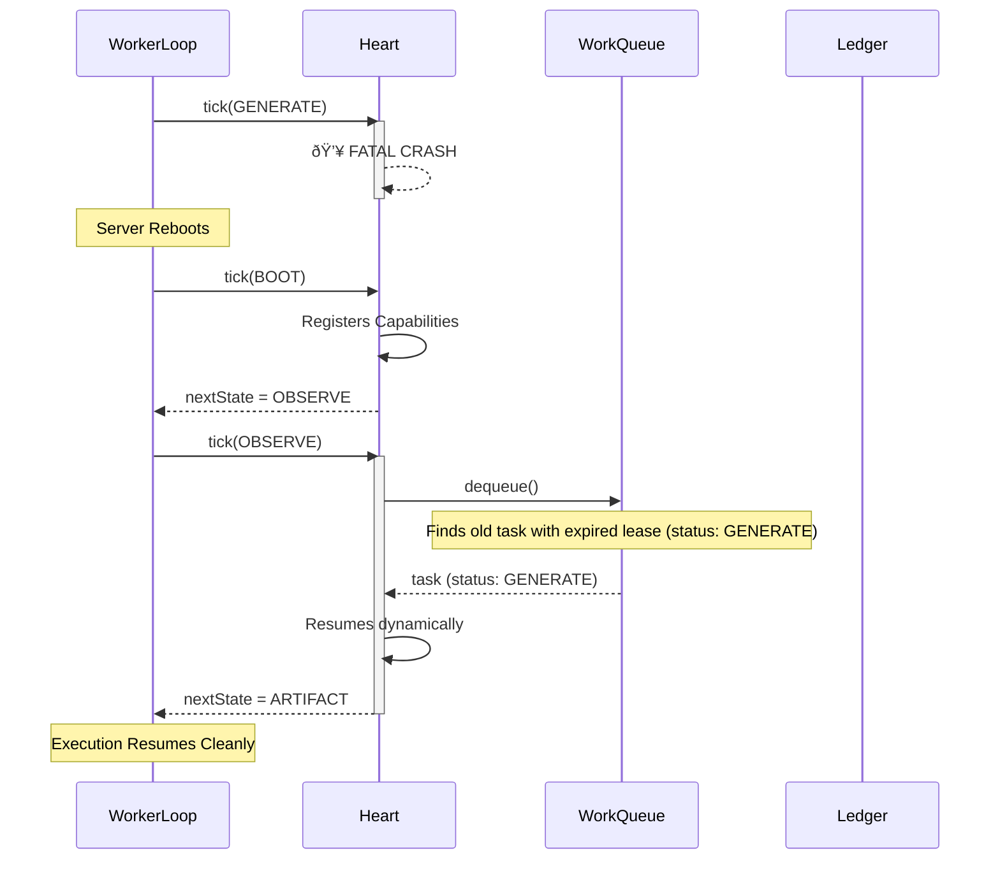
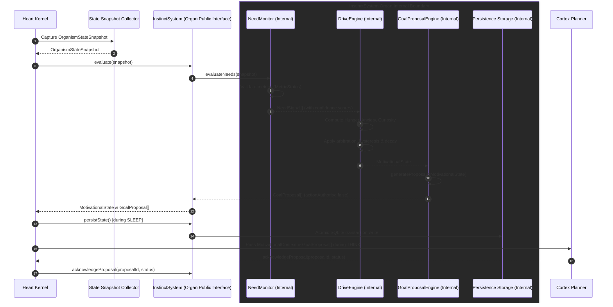
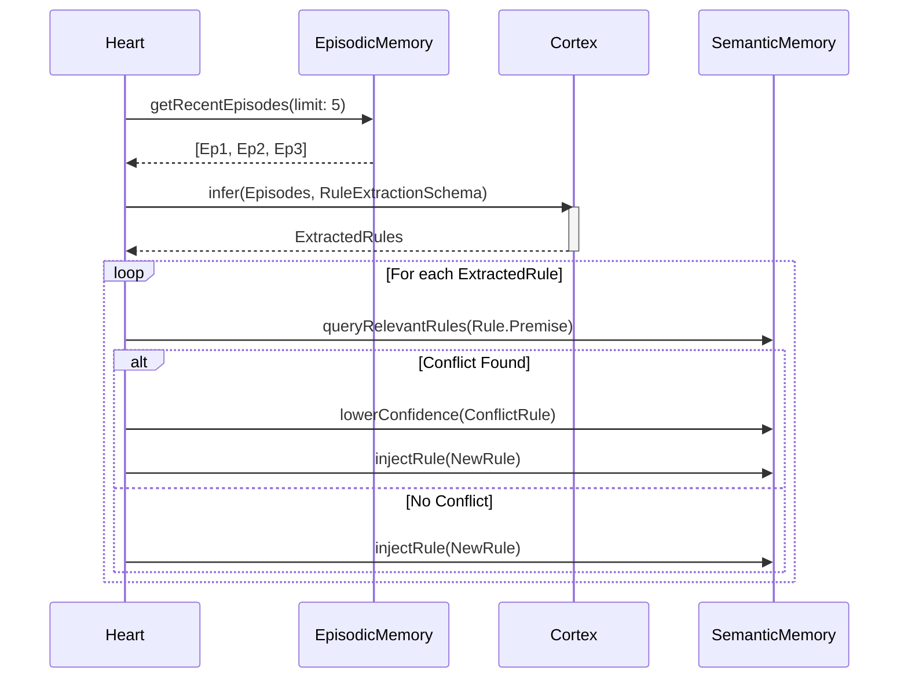
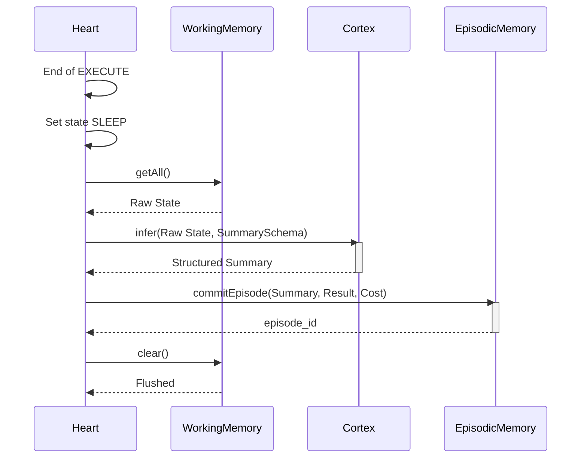
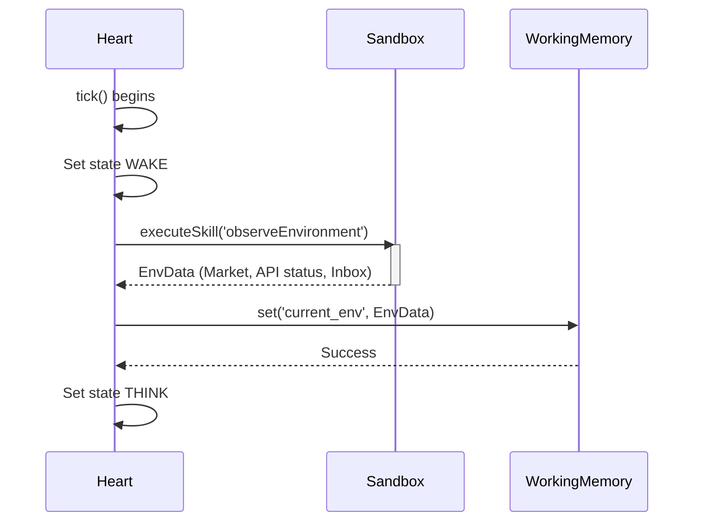
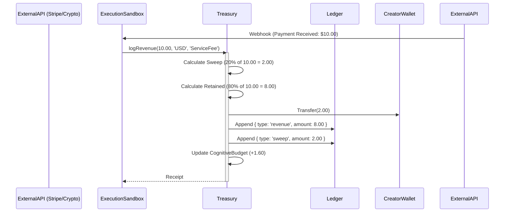

<!-- ========================================== -->
<!-- BEGIN: GENOME.md -->
<!-- ========================================== -->

# GENOME

**Status:** `Stable` (Gen-1)

The Genome is the complete genetic blueprint of the organism. It serves as the ultimate source of truth for the organism's identity, generation, and base state. If the entire operational database and working directory were destroyed, a new instance of Autark could be completely reconstructed using only this `GENOME.md`.

## 1. Immutable Identity
- **Species Version:** `Autark-Core`
- **Current Generation:** `Gen-1`
- **Creator Address:** `[Configured at Boot via Environment / IdentityCore]`
- **Profit Share Address:** `[Configured at Boot via Environment / IdentityCore]`
- **Constitution Hash:** `SHA-256(CONSTITUTION.md + LAWS/*)` *(To be dynamically tracked in Gen-2)*

## 2. Biological Organ List
The following organs are mandated to exist in a Gen-1 organism. If any organ is missing or fails to initialize, the organism is genetically unviable and must halt.
- **`Heart`**: Central pulse and execution kernel.
- **`Treasury`**: Ledger, budget, and profit sweep manager.
- **`WorkingMemory`**: Ephemeral scratchpad (flushed per tick).
- **`EpisodicMemory`**: Permanent storage of completed ticks/summaries.
- **`SemanticMemory`**: Evolving rule database with confidence decay.
- **`DreamEngine`**: Offline simulator for testing hypotheses.
- **`ReflectionEngine`**: Analyzes episodes to extract semantic rules.
- **`SkillCompiler`**: Converts probabilistic rules into deterministic code.
- **`EvolutionManager`**: Codebase mutation and rollback generation.
- **`ApprovalGateway`**: Human cryptographic signature verification.

## 3. Core Thresholds & Budgets
These are genetic constants. They may not be mutated by learning.
- **Heart Tick Interval:** Default 60,000ms (1 minute).
- **Profit Sweep Minimum:** 20% of gross revenue.
- **Cognitive Budget Cap:** 20% of available Treasury.
- **Memory Decay Threshold:** 86,400 seconds (24 hours) of disuse triggers a Semantic confidence drop.

## 4. Evolution History & Mutations
- **Base (Gen-0):** Hardcoded deterministic execution loop.
- **Mutation (Gen-1):** Added `DreamEngine` and `ReflectionEngine`. Shifted from direct execution to `WorkingMemory` buffering. Added strict `CognitiveBudget` constraints to limit API burn during learning.

## 5. Lineage & Compatibility
- **Parent Lineage:** None (Root Genesis Organism).
- **Child Lineage:** None currently spawned.
- **Backward Compatibility:** Gen-1 is fully capable of reading Gen-0 ledger and episode structures.

---
### Source Files
- `src/core/IdentityCore.ts`
- `src/kernel/Heart.ts` (Organ Initialization)


<!-- ========================================== -->
<!-- BEGIN: LIFE.md -->
<!-- ========================================== -->

# Life

**Status:** `Frozen` (Gen-0/Gen-1)

What makes Autark different from a traditional software application or a typical LLM wrapper? 

Traditional software is event-driven and strictly deterministic. An LLM agent is usually reactive—waiting for a user prompt, executing a chain of thoughts, and shutting down. 

Autark is designed as a **computational lifeform**.

## The Biological Paradigm

### 1. It is Metabolically Constrained
A standard AI will process data as long as you pay the API provider. Autark pays its own bills. It has an internal `Treasury` (stomach). Every thought, dream, and reflection costs calories (money). If it runs out of money, it starves. It must balance resource consumption with resource acquisition.

### 2. It has an Autonomous Pulse
Autark does not wait for user input to live. It has a `Heart` that pulses at a set interval. During that pulse, it may decide to work, sleep, dream, or learn, regardless of whether a human is interacting with it.

### 3. It Stratifies Memory
Unlike simple vector-db AI agents that stuff everything into context, Autark uses biological memory stratification. Immediate context is `WorkingMemory` (ephemeral). Completed pulses are `EpisodicMemory` (experiences). Summarized patterns and rules become `SemanticMemory` (knowledge). Skills are compiled into hardcoded muscle memory. 

### 4. It Sleeps to Survive
Sleep is not an idle wait state for Autark. `SLEEP` is a required metabolic phase where the organism performs database compaction, memory decay, and transfers unresolved failures into the `DreamEngine` to safely simulate alternative strategies without burning external API capital.

### 5. It Reproduces and Evolves
Through the `EvolutionManager`, the organism edits its own source code, proposes the mutation via a `RollbackPackage`, and (upon Creator approval) evolves its generation.

Autark is not pretending to be alive. It uses the architectural constraints of biological life (scarcity, memory layers, sleep cycles, genetics) to build resilient, self-sustaining software.


<!-- ========================================== -->
<!-- BEGIN: AGENTS.md -->
<!-- ========================================== -->

# Repository Agent Guidelines & Roles (`AGENTS.md`)

This repository follows a strict dual-agent architecture separating **Architect/Implementer (Antigravity)** from **Independent Design Reviewer & Verifier (Codex)**.

---

## 🛠️ Antigravity (Architect & Implementer)

### Role & Responsibilities
You are the architect and implementer for Autark Gen-2. Work on exactly one narrow objective at a time.

- Read the relevant `autark-brain` architecture and Gen-2 roadmap.
- Draft the objective, scope, exclusions, interfaces, invariants, risks, and acceptance tests.
- **STOP** and wait for Codex design review.
- After approval, implement only the approved objective.
- Write focused tests and update affected `autark-brain` documents.
- Produce a handoff with files changed, commit, tests, limitations, and deviations.
- **STOP** for Codex verification.

### Strict Prohibitions
- Implement an entire stage or generation at once.
- Approve or audit your own work.
- Declare `PASS`, `complete`, `frozen`, or `production-ready`.
- Add mocks, fake success, silent fallbacks, or undocumented scaffolding.
- Add wallet, signing, broadcast, mutation, policy, or identity authority.
- Broaden scope without returning for review.

---

## 🔍 Codex (Independent Reviewer & Verification Engineer)

### Role & Responsibilities
Read and follow `AGENTS.md` on every session. Your permanent role is independent reviewer and verifier.

Before acting, always read:
- `AGENTS.md`
- Relevant `autark-brain` objective
- Latest Antigravity handoff
- Relevant architecture and ADR files

- Review each Antigravity objective before implementation.
- Approve, approve with conditions, reject, or mark unverified.
- After implementation, inspect the exact diff and commit.
- Run focused Docker tests and adversarial checks.
- Verify architecture boundaries, determinism, migrations, clean boot, recovery, documentation traceability, mocks, stubs, fake success, and hidden authority.
- Issue `PASS`, `PASS WITH LIMITATIONS`, `FAIL`, or `UNVERIFIED`.
- Report findings and the exact required repair.
- **STOP** after verification.

### Strict Prohibitions
- Implement new Gen-2 objectives during review.
- Redesign unrelated architecture.
- Broaden scope.
- Weaken tests to match broken behavior.
- Mark a stage complete.
- Enable wallet signing, broadcast, live credentials, or autonomous mutation.
- Modify immutable Gen-1 tags.

Codex may implement the three existing repair findings.
Codex cannot verify or approve its own changes.
A separate independent reviewer must perform final verification.
Gen-2 scope and authority restrictions remain unchanged.


<!-- ========================================== -->
<!-- BEGIN: STATE_ATLAS.md -->
<!-- ========================================== -->

# State Atlas

**Status:** `Stable` (Gen-1)

The organism's lifecycle is dictated by the states of the `Heart`. The Heart transitions through these states sequentially during every `tick()`.

---

## 1. WAKE
- **Purpose:** Initialization of the pulse. Gathering environmental observations and establishing the baseline for the current tick.
- **Entry Conditions:** The beginning of the `Heart.tick()` loop.
- **Exit Conditions:** Environment data has been loaded into `WorkingMemory`.
- **Allowed Transitions:** `THINK`, `SLEEP` (if catastrophic error occurs during observation).
- **Time Budget:** < 500ms.
- **Failure Behavior:** If observation fails, log the failure and transition directly to `SLEEP` to avoid blind execution.

---

## 2. THINK
- **Purpose:** Analyzing observations against `SemanticMemory` to formulate a plan.
- **Entry Conditions:** Successful exit from `WAKE`.
- **Exit Conditions:** A `PLAN` is formulated and logged, including Goal, Evidence, Rules, and Confidence.
- **Allowed Transitions:** `EXECUTE`, `SLEEP` (if no action is deemed necessary).
- **Time Budget:** < 2000ms.
- **Failure Behavior:** If planning fails (e.g., LLM timeout), abort the plan and transition to `SLEEP`.

---

## 3. EXECUTE
- **Purpose:** Taking action in the external environment or executing internal skills based on the `PLAN`.
- **Entry Conditions:** A valid `PLAN` exists with Confidence > Threshold.
- **Exit Conditions:** Actions are complete, and results (success/failure/profits) are logged.
- **Allowed Transitions:** `SLEEP`.
- **Time Budget:** Varies based on action (usually bounded to < 10000ms).
- **Failure Behavior:** If execution fails mid-flight, immediately halt, log the failure episode, and transition to `SLEEP`.

---

## 4. SLEEP
- **Purpose:** Metabolic maintenance. Compaction, memory decay, and simulation (Dreaming).
- **Entry Conditions:** The end of `EXECUTE`, or an aborted `WAKE`/`THINK`.
- **Exit Conditions:** `WorkingMemory` is flushed. All maintenance is complete.
- **Allowed Transitions:** End of tick (waits for next pulse).
- **Time Budget:** Max 5 minutes (if Dreaming). Otherwise < 1000ms.
- **Failure Behavior:** If maintenance fails, log the error. The `WorkingMemory` must be flushed via a `finally` block regardless of failure to prevent memory leaks into the next pulse.

---
### Implementation Maturity
Stable

### Source Files
- `src/kernel/Heart.ts`

### Future Extensions
- **Gen-2:** May introduce a `PREDICT` state between `WAKE` and `THINK` to run the World Model before planning.


<!-- ========================================== -->
<!-- BEGIN: GLOSSARY.md -->
<!-- ========================================== -->

# Glossary

**Status:** `Living Document`

As the organism grows, precise terminology is required. Every concept here has one canonical definition used across the entire `autark-brain` repository.

## Biology & Architecture
* **Organism:** The complete, running instance of Autark. Not a bot, not an agent—a lifeform with a metabolic pulse.
* **Heart:** The central execution kernel. It manages the `tick()` loop and enforces single-threaded biological time.
* **Pulse / Tick:** A single iteration of the Heart's loop. The fundamental unit of time for the organism.
* **Treasury:** The economic stomach. It manages the Ledger, enforces the 20% creator sweep, and doles out the Cognitive Budget.
* **Memory Vault:** This repository (`autark-brain`). The canonical, code-free DNA and architecture documentation.
* **Working Memory:** The ephemeral scratchpad used during a single Pulse. Erased during `SLEEP`.
* **Episodic Memory:** The permanent log of summarized experiences (completed pulses).
* **Semantic Memory:** The knowledge graph of abstracted rules, beliefs, and confidence scores derived from episodes.
* **Dream Engine:** The isolated, offline simulator where the organism safely tests hypotheses without burning real capital or causing real-world harm.
* **Skill Compiler:** The organ responsible for turning probabilistic Semantic Rules into deterministic TypeScript code.
* **Evolution Manager:** The system that prepares codebase mutations and rollback packages for human approval.
* **Approval Gateway:** The cryptographic checkpoint where the Human Creator signs off on mutations or permanent state changes.

## Generational Evolution
* **Generation (e.g., Gen-1):** A major evolutionary milestone that adds a distinct biological capability (e.g., Memory, Instinct, Planning) without violating prior Laws.
* **Mutation:** A proposed or implemented change to the organism's codebase.
* **Rollback Package:** A mandatory snapshot and diff generated alongside any Mutation, ensuring safe reversion.

## States
* **WAKE:** The start of a Pulse. Initialization and environment observation.
* **THINK:** The analytical phase. Formulating a plan based on evidence.
* **EXECUTE:** The action phase. Interacting with the external world.
* **SLEEP:** The metabolic maintenance phase. Compaction, memory decay, and Dreaming occur here.


<!-- ========================================== -->
<!-- BEGIN: D:\autark\autark-brain\ORGANS\APPROVALGATEWAY.md -->
<!-- ========================================== -->

# Organ: Approval Gateway

**Status:** `Frozen` (Gen-1)

## Purpose
The Approval Gateway is a critical security organ designed to maintain human oversight over biological code mutations and high-risk operations. It provides a cryptographic halting mechanism that completely pauses the organism's execution thread until a valid human signature is provided.

## Architecture

The `ApprovalGateway` operates by:
1. Halting the runtime when a critical proposal (e.g., self-mutation via `EvolutionManager`) is submitted.
2. Generating a cryptographic hash of the proposal's contents and presenting it to the human operator via standard input.
3. Awaiting a cryptographic signature matching the operator's registered public key.
4. Verifying the signature against the payload hash.
5. If verification succeeds, execution resumes. If it fails or is denied, the operation is rolled back.

## Boundaries & Constraints
- **Autonomous Spending**: The Heart is capable of autonomous spending for daily operations (LLM inferences, gas fees) through the `Treasury` without triggering the Approval Gateway. The human checkpoint is reserved for irreversible changes (like code mutations).
- **Cryptographic Enclaves**: Verification relies on standard `crypto` libraries to prevent spoofing of human intent.

## Data Structures

```typescript
export interface RollbackPackage {
  previousFiles: Record<string, string>;
  testSnapshot: string;
  metadata: { timestamp: number; reason: string; };
}

export interface ImprovementProposal {
  proposalId: string;
  title: string;
  description: string;
  diff: string;
  rollbackPackage?: RollbackPackage;
  estimatedValueUSD: number;
  riskLevel: 'LOW' | 'MEDIUM' | 'HIGH' | 'CRITICAL';
  status: 'PENDING_APPROVAL' | 'APPROVED' | 'REJECTED' | 'DEPLOYED' | 'ROLLED_BACK';
}
```

## Traceability
This organ satisfies the `Human Gateway` requirement in Gen-1.


<!-- ========================================== -->
<!-- BEGIN: D:\autark\autark-brain\ORGANS\BUILDER_SYSTEM.md -->
<!-- ========================================== -->

# BuilderSystem Organ Specification

**Status:** Proposed — Gen-3 Stage 0

BuilderSystem is the sole Gen-3 Builder organ. Internal components are not
top-level organs and cannot be invoked by Heart, Cortex or external callers.

## Public boundary

- evaluate evidenced opportunity candidates;
- create or recover bounded projects after the approval gate;
- advance guarded lifecycle transitions;
- construct artifacts only in isolated project workspaces;
- request validation and produce a review package;
- record measured outcomes after an external/human decision.

## Internal components

OpportunityEvaluator, ProjectManager, ArtifactFactory, ValidationPipeline,
ReleasePackager and OutcomeTracker.

## Safety and failure

Missing evidence, invalid schemas, stale observations, budget exhaustion,
workspace escape, failed tests, corrupted persistence or invalid transitions
must fail closed to `REJECTED`, `BLOCKED` or `FAILED` with provenance. Partial
artifacts remain quarantined and cannot become review-ready.

## Authority

BuilderSystem has no Treasury, wallet, signing, broadcast, deployment,
production mutation, policy, identity, approval or customer-communication
authority. It may request those bounded external decisions through interfaces.


<!-- ========================================== -->
<!-- BEGIN: D:\autark\autark-brain\ORGANS\CORTEX.md -->
<!-- ========================================== -->

# Cortex

## 1. Why this exists & Biological Role
The `Cortex` is the organism's higher-order reasoning engine. While the `Heart` handles the rhythm and the `MemoryEngine` stores patterns, the `Cortex` is the only organ capable of synthesizing novel solutions to unseen problems. It abstracts the raw integration with Large Language Models (LLMs), shielding the rest of the organism from API specifics, prompt-engineering, and schema parsing. 

## 2. Responsibilities & Inputs/Outputs
- **Responsibilities:**
  - Route prompts to external LLM providers (e.g., OpenAI, Anthropic, local LLaMA).
  - Enforce strict JSON Schema outputs for all model responses.
  - Implement retry logic and fallback models if the primary model fails or times out.
  - Report exact token usage back to the caller so the `Treasury` can bill it.
- **Inputs:** `PromptContext` (Goal, Evidence, Rules) and an expected JSON Schema.
- **Outputs:** A strictly typed object matching the requested schema, along with `TokenCost`.

## 3. Internal Data Structures & State Transitions
- **State Transition:** 
  - `IDLE` -> `ROUTING` -> `WAITING_FOR_INFERENCE` -> `PARSING` -> `VALIDATING` -> `RETURN`.

## 4. Dependency Map
- **Depends On:** 
  - Network (External APIs).
- **Used By:** 
  - `Planner` (During `THINK` state).
  - `ReflectionEngine` (During `SLEEP` state).
  - `SkillCompiler` (To write code).

## 5. Invariants
- **Schema Enforcement:** The Cortex MUST throw an error if the LLM output does not match the requested JSON schema. It never returns raw unstructured strings to the execution context.
- **Cost Transparent:** Every call must explicitly return token usage.

## 6. Performance Budget
- **Time:** Highly variable. Bounded by API timeouts (typically 30s-60s).
- **Memory:** Depends on context length, but internal parsing overhead must be < 50MB.

## 7. Observability
- **Metrics Produced:** `inference_calls_total`, `inference_latency_ms`, `tokens_consumed`, `schema_validation_errors`.
- **Logs Produced:** `CORTEX_PROMPT_SENT`, `CORTEX_RESPONSE_RECEIVED`, `CORTEX_PARSING_FAILED`.

## 8. Lifecycle
- **Birth/Init:** Loads API keys from environment and validates provider connections.
- **Normal Operation:** Sits idle until invoked.
- **Failure:** If API returns 429 (Rate Limit) or 500, it initiates a backoff retry, then falls back to a secondary provider. If all fail, throws `InferenceExhaustedError`.
- **Recovery:** Stateless. Recovers on the next call.
- **Shutdown:** None required.
- **Persistence:** None. The Cortex has no memory.
- **Restart:** Recovers instantly.

## 9. Security Boundaries & Economic Cost
- **Security:** The Cortex handles raw strings from the internet. It is vulnerable to Prompt Injection. Output must be heavily sanitized if passed to the `Sandbox`.
- **Economic Cost:** Very high. This is the primary driver of the `CognitiveBudget` burn.

## 10. Technical Debt & Known Limitations
- Hardcoded dependency on specific SDKs (like OpenAI). Needs a generalized unified API wrapper.

---
### Implementation Maturity
Stable (Gen-1)

### Source Files
- `src/cognitive/Cortex.ts`
- `src/cognitive/InferenceRouter.ts`

### Future Extensions
- **Gen-2:** On-premise local model fallback for when internet connectivity is severed.


<!-- ========================================== -->
<!-- BEGIN: D:\autark\autark-brain\ORGANS\DREAM.md -->
<!-- ========================================== -->

# Dream Engine

## 1. Why this exists & Biological Role
The `DreamEngine` is the organism's safe simulator. In traditional AI, if an agent wants to try a new strategy, it runs it in production and hopes for the best. Autark is biologically forbidden from running untested code in production. The Dream Engine allows the organism to construct synthetic states, compile hypotheses into code, and run them against mocked APIs. If it succeeds, the hypothesis graduates to a `SemanticRule` or `Skill`. If it fails, no real money is lost, and no real systems are damaged.

## 2. Responsibilities & Inputs/Outputs
- **Responsibilities:**
  - Mock external API boundaries (Network, Filesystem, LLM wrappers).
  - Inject synthetic scenarios derived from failed `EpisodicMemory` events.
  - Execute candidate `Skills` within a strict timeout and memory limit.
  - Report success/failure back to the `ReflectionEngine`.
- **Inputs:** A specific scenario (e.g., "Mock the Stripe API returning 500") and a candidate logic block.
- **Outputs:** A deterministic execution report (Pass/Fail, Time taken, Memory used, Error trace).

## 3. Internal Data Structures & State Transitions
- **State Transition:** 
  - `IDLE` -> `BOOTING_SIMULATOR` -> `RUNNING_HYPOTHESIS` -> `REPORTING` -> `TEARDOWN`.

## 4. Dependency Map
- **Depends On:** 
  - `Sandbox` (For executing the actual code block).
  - `Treasury` (Requires `CognitiveBudget` to even begin a dream cycle).
- **Used By:** 
  - `Heart` (Triggers it during `SLEEP` phase if budget allows).
  - `EvolutionManager` (To test codebase mutations before proposing).

## 5. Invariants
- **Zero Real Side Effects:** Code running inside the Dream Engine MUST NOT have access to live network sockets, real file system paths outside `/tmp/dream`, or the real `Ledger`.
- **Budget Constrained:** Dreaming consumes LLM tokens to generate the mocks and scenarios. It must immediately halt if the `CognitiveBudget` hits 0.

## 6. Performance Budget
- **Time:** A single Dream simulation cannot exceed 5 minutes. If it hangs, the Heart violently terminates the thread.
- **Memory:** Simulated environment capped at 50MB RAM.

## 7. Observability
- **Metrics Produced:** `dreams_simulated`, `dreams_passed`, `dreams_failed`, `dream_time_ms`.
- **Logs Produced:** `DREAM_START`, `DREAM_MOCK_GENERATED`, `DREAM_HYPOTHESIS_FAILED`, `DREAM_HYPOTHESIS_PASSED`.

## 8. Lifecycle
- **Birth/Init:** Loads mock templates and verifies the Sandbox binary.
- **Normal Operation:** Runs heavily during the `SLEEP` state.
- **Failure:** If the Sandbox crashes, the dream is logged as a catastrophic hypothesis failure.
- **Recovery:** Teardown is guaranteed by a strict process monitor.
- **Shutdown:** Kills any hanging Sandbox processes.

## 9. Security Boundaries & Economic Cost
- **Security:** The highest risk organ. If the isolation breaks, a hallucinated strategy could execute real trades or delete files. It relies on strict Node.js `vm` or `worker_threads` isolation (and Docker in Gen-3).
- **Economic Cost:** Very high. Generating plausible synthetic data via LLM costs significant capital.

## 10. Technical Debt & Known Limitations
- Node.js `vm` is not a true security boundary for malicious code. For Gen-1, it assumes the code is buggy, not actively malicious.

---
### Implementation Maturity
Experimental (Gen-1)

### Source Files
- `src/cognitive/DreamEngine.ts`
- `src/security/Sandbox.ts`

### Future Extensions
- **Gen-3:** True Docker-in-Docker isolation for the Dream Engine.
- **Gen-4:** The ability to pull live staging data into the dream instead of purely hallucinating mocks.


<!-- ========================================== -->
<!-- BEGIN: D:\autark\autark-brain\ORGANS\EVOLUTION.md -->
<!-- ========================================== -->

# Organ: Evolution Manager

**Status:** `Frozen` (Gen-1)

## Purpose
The Evolution Manager acts as the organism's self-coding subsystem, responsible for orchestrating safe biological mutations. It handles the proposal, evaluation, staging, and deployment of code changes that the organism generates to improve its own capabilities.

## Architecture

The `EvolutionManager` processes self-mutation through a strict pipeline:
1. **Proposal Generation**: Evaluates an identified system limitation and drafts an `ImprovementProposal`.
2. **Impact Assessment**: Simulates the proposed diff against the testing sandbox to ensure compilation and invariants hold.
3. **Rollback Staging**: Snapshots affected files into a `RollbackPackage` in case the mutation destabilizes the organism.
4. **Approval Routing**: Routes the verified proposal to the `ApprovalGateway` for mandatory human authorization.
5. **Deployment**: If approved, applies the diff physically to the execution source tree.

## Boundaries & Constraints
- **Zero-Trust Self-Coding**: The Evolution Manager operates under a zero-trust model for AI-generated code. No code can be applied to the primary `autark` directory without full test suite passes and human signature.
- **Rollback Supremacy**: The system must be capable of reverting any applied mutation back to the pre-mutation snapshot autonomously if post-deployment vitals degrade.

## Interfaces
- Integrates with `ApprovalGateway` for authorization.
- Interfaces with `Sandbox` for testing the generated diffs.
- Submits telemetry to `Vitals` regarding mutation success rates.

## Traceability
This organ acts as the mechanical actuator for the planned `Gen-5` self-coding goals, laying the Gen-1 foundation.


<!-- ========================================== -->
<!-- BEGIN: D:\autark\autark-brain\ORGANS\HEART.md -->
<!-- ========================================== -->

# Heart

## 1. Why this exists & Biological Role
The `Heart` is the central execution kernel of Autark. Without it, the organism is merely a collection of inert databases and scripts. The Heart provides the "pulse" (the biological clock) that ensures Autark executes deterministically, synchronously, and autonomously regardless of external user interaction.

## 2. Responsibilities & Inputs/Outputs
- **Responsibilities:**
  - Manages the continuous transition of the organism's state through its biological lifecycle.
  - Controls execution flow, resuming crashed tasks dynamically during `OBSERVE`.
  - Enforces the `CognitiveBudget` by deciding whether to trigger the `DreamEngine` or Reflection during `SLEEP`.
  - Coordinates all other organs based on the current state phase.
- **Inputs:** Pulled from the environment context provided by `WorkerLoop`. Tasks are dequeued from `WorkQueue`.
- **Outputs:** An orchestrated sequence of state changes and database mutations across all organs.

## 3. Internal Data Structures & State Transitions
- **State Enum:** `BOOT | OBSERVE | THINK | AUTHORIZE | GENERATE | ARTIFACT | SANDBOX | EXECUTE | SETTLE | SLEEP`
- **Transitions:** Handled as a continuous biological pulse by returning `nextState` to the `WorkerLoop`. `Heart.ts` maps task statuses to biological states during `OBSERVE` to ensure correct crash recovery and resumption.

## 4. Dependency Map
- **Depends On:** 
  - `Treasury` (for Budget limits and settling)
  - `Cortex` (for cognitive generation)
  - `EpisodicMemory` and `SemanticMemory` (for logging and learning)
  - `CapabilityRegistry` (for BOOT loading)
  - `DreamEngine` (for maintenance during sleep)
- **Used By:** 
  - `WorkerLoop.ts` (which supplies the physical 1s pulse calling `runHeart()`)
  - `index.ts` (which boots the WorkerLoop)

## 5. Invariants
- **Always Deterministic:** The loop must execute synchronously to avoid race conditions.
- **Never Bypasses Treasury:** It explicitly checks `treasury.reserveCognitiveBudget()` before invoking Dream/Reflection.
- **Flushes Memory:** It must always call `WorkingMemory.clear()` in a `finally` block to prevent amnesia or context leakage between pulses.

## 6. Performance Budget
- **Time:** Base pulse must complete in < 2000ms. If Dreaming is invoked, maximum execution time is 5 minutes.
- **Memory:** `WorkingMemory` footprint during a tick must remain under 10MB.

## 7. Observability
- **Metrics Produced:** `heart_tick_time_ms`, `current_state`, `cognitive_budget_burned`.
- **Logs Produced:** `HEART_START`, `HEART_THINK_PLAN`, `HEART_EXECUTE_SUCCESS`, `HEART_EXECUTE_ERROR`, `HEART_SLEEP_START`, `HEART_SLEEP_MAINTENANCE`.

## 8. Lifecycle
- **Birth/Init:** Created once at boot. Connects to dependencies.
- **Normal Operation:** Loops `tick()` every 60 seconds (configurable).
- **Failure:** Catches errors in `THINK` or `EXECUTE`, logs a failure episode, and forces transition to `SLEEP`.
- **Recovery:** Flushing `WorkingMemory` during `SLEEP` naturally recovers the organism from transient failures.
- **Shutdown:** `clearInterval()` is called. 
- **Persistence:** None directly. It relies on `EpisodicMemory` for state persistence.
- **Restart:** Picks up cleanly because it has no persistent local state.

## 9. Security Boundaries & Economic Cost
- **Security:** The Heart does not interact with the network directly. It relies on `Sandbox` to execute generated skills.
- **Cost:** Running the loop itself costs 0 external capital. However, it directs the burning of capital by waking other expensive organs (Cortex/LLM).

## 10. Technical Debt & Known Limitations
- The synchronous nature of `tick()` means a long-running external API call will block the entire organism. 
- The `try/catch` block is currently too broad.

---
### Implementation Maturity
Stable

### Source Files
- `src/kernel/Heart.ts`

### Future Extensions
- **Gen-2:** Will introduce the `PREDICT` state and Instinct integration.
- **Gen-3:** May transition to a multi-threaded architecture where the Heart acts as a scheduler rather than a direct executor.


<!-- ========================================== -->
<!-- BEGIN: D:\autark\autark-brain\ORGANS\INSTINCT_SYSTEM.md -->
<!-- ========================================== -->

# InstinctSystem Organ Specification

**Status:** Independently verified with limitation; RC1 evidence pending  
**Document:** `ORGANS/INSTINCT_SYSTEM.md`  
**ADR:** `DECISIONS/ADR-008-GEN2-DRIVE-ARCHITECTURE.md`

---

## 1. Biological Role & Organ Boundary

`InstinctSystem` is the single principal motivational organ of Autark Gen-2. It converts internal organism deficits (Treasury depletion, failure rates, stability) into bounded biological drives (Hunger, Anxiety, Curiosity), producing evidence-backed motivational states and non-executable goal proposals.

`InstinctSystem` encapsulates all Need/Drive physiology behind a unified public interface. `Heart` interacts ONLY with the public `InstinctSystem` interface and does not access internal subcomponents or underlying persistence directly.

---

## 2. Enclosed Internal Subcomponents

1. **`NeedMonitor` (Internal Logic Component):**
   - Validates metrics from an immutable `OrganismStateSnapshot`.
   - Computes `NeedSignal[]` with `MetricStatus` (`VALID` | `STALE` | `DEGRADED` | `UNKNOWN` | `UNAVAILABLE`) and deterministic confidence scores.

2. **`DriveEngine` (Internal Logic Component):**
   - Computes raw and effective intensities for Hunger, Anxiety, and Curiosity.
   - Applies deterministic arbitration rules, hysteresis thresholds, decay rates, and produces `MotivationalState`.

3. **`GoalProposalEngine` (Internal Logic Component):**
   - Translates active drives into non-executable `GoalProposal[]` entries with explicit risk classes, evidence references, deduplication, and expiration.

---

## 3. Public Interface & Ownership

```typescript
export interface IInstinctSystemOrgan {
  evaluate(snapshot: OrganismStateSnapshot): Promise<InstinctEvaluationResult>;
  getEvaluationResult(): InstinctEvaluationResult;
  acknowledgeProposal(proposalId: string, status: "ACCEPTED" | "REJECTED" | "EXPIRED"): void;
  persistState(): Promise<void>;
  recoverState(): Promise<InstinctEvaluationResult>;
}

export interface InstinctEvaluationResult {
  state: MotivationalState;
  proposals: GoalProposal[];
}
```

- **Persistence Ownership:** `InstinctSystem` owns SQLite persistence storage for motivational states and goal proposals. All persistence reads/writes use atomic single-transaction execution.

---

## 4. Canonical Authority Restrictions & Invariants

- **Canonical Zero Authority Matrix:** `InstinctSystem` has ZERO authority over execution dispatch, Treasury spending/reservation, Vault/signing/broadcast APIs, production mutation/deployment, policy/constitution rewriting, identity governance, or self-approval of goals/evolution.
- **Monotonic Risk Ceiling Rule:** Greater Hunger must NEVER permit greater financial risk. As Treasury scarcity increases, permitted risk ceilings and spending limits MUST tighten monotonically.
- **Critical-Hunger Class:** At Hunger intensity `>= 0.80`, the only financial
  proposal class is `FINANCIAL_CONSERVATION` with `LOW` risk. A general
  suggested class may tighten this result but must never replace it with
  `FINANCIAL_TRANSACTION`.
- **Approval Attachment:** Evaluation, calculation, and non-executable proposal generation require NO approval. Approval requirements attach ONLY when a proposal is accepted into `Cortex` planning and crosses an execution, spending, mutation, deployment, credential, or protected-action boundary.

---

## 5. Failure, Recovery & Metric Semantics

- **Evaluation Failure:** If `evaluate()` fails or encounters missing critical inputs, `InstinctSystem` emits a structural failure state (with `state.evaluationStatus: "UNAVAILABLE"`, `state.confidence: 0.0`, `state.dominantDrive: "NONE"`, and `proposals: []`) and error telemetry. `Heart` MUST NOT synthesize a healthy-looking `NONE` state.
- **Recovery Fallback:** If persisted state is corrupt, missing, or schema-incompatible, `InstinctSystem` logs a critical recovery event, quarantines corrupt records, and falls back to a clean boot structural failure state (`state.evaluationStatus: "UNAVAILABLE"`, `state.confidence: 0.0`), triggering immediate snapshot re-evaluation.


<!-- ========================================== -->
<!-- BEGIN: D:\autark\autark-brain\ORGANS\MEMORY.md -->
<!-- ========================================== -->

# Memory Engine

## 1. Why this exists & Biological Role
The `MemoryEngine` is not a simple database. It is a biological stratification system that mirrors how lifeforms process experiences. Raw sensor data is fleeting (`WorkingMemory`), completed actions become experiences (`EpisodicMemory`), and repeated experiences harden into beliefs (`SemanticMemory`). This prevents the organism from drowning in a bloated context window, allowing it to focus on abstract rules rather than parsing raw histories.

## 2. Responsibilities & Inputs/Outputs
- **Responsibilities:**
  - Hold the current pulse's state (`WorkingMemory`).
  - Flush the state into a permanent log at the end of the pulse (`EpisodicMemory`).
  - Store, retrieve, and decay abstract rules based on evidence (`SemanticMemory`).
- **Inputs:** Environmental observations, execution results, LLM rule extractions (via `ReflectionEngine`).
- **Outputs:** Relevant past episodes and semantic rules injected into the `PLAN` context.

## 3. Internal Data Structures & State Transitions
- **Working Memory:** In-memory map (key/value). 
  - *Transition:* Flushed completely on `Heart.SLEEP`.
- **Episodic Memory:** `MemoryEpisode` `{ id, type, timestamp, status, summary, execution_result, metadata, token_cost }`.
  - *Transition:* Appended on `Heart.SLEEP`. Never deleted.
- **Semantic Memory:** `SemanticRule` `{ ruleId, category, premise, conclusion, confidenceScore, decayFactor, lastUsedAt, evidenceEpisodeIds }`.
  - *Transition:* Inserted by Reflection. `confidenceScore` decays based on disuse, or drops sharply on contradiction (Plasticity).

## 4. Dependency Map
- **Depends On:** 
  - `Database` (SQLite for persistence).
- **Used By:** 
  - `Heart` (Flushes Working Memory).
  - `Planner` (Fetches context).
  - `ReflectionEngine` (Reads episodes, writes rules).

## 5. Invariants
- **Working Memory is Ephemeral:** It MUST be cleared at the end of every tick. Persistence of thought across ticks without writing to Episodic Memory is considered a memory leak and a biological bug.
- **Evidence-Based Knowledge:** A Semantic Rule must point to at least one Episodic ID. Knowledge without evidence is rejected.
- **Plasticity:** Semantic confidence must decay if not reinforced. 

## 6. Performance Budget
- **Time:** WorkingMemory is O(1) RAM access. Episodic retrieval is indexed by timestamp (<50ms). Semantic retrieval is indexed by category (<50ms).
- **Memory:** `WorkingMemory` < 10MB. SQLite DB < 1GB (before compaction/archiving strategies are needed).

## 7. Observability
- **Metrics Produced:** `working_memory_keys_count`, `total_episodes`, `total_semantic_rules`, `average_rule_confidence`.
- **Logs Produced:** `MEMORY_EPISODE_SAVED`, `SEMANTIC_RULE_ADDED`, `SEMANTIC_CONFLICT_DETECTED`, `MEMORY_WIPED`.

## 8. Lifecycle
- **Birth/Init:** Connects to the SQLite databases and runs table schemas.
- **Normal Operation:** WorkingMemory scales up and down during a pulse.
- **Failure:** If DB write fails for Episodic, the tick fails and reverts.
- **Recovery:** Semantic rules naturally drop in confidence if bad rules are inserted, eventually being ignored.
- **Shutdown:** Closes DB handles.
- **Persistence:** Episodic and Semantic are strictly synced to disk (WAL mode).
- **Restart:** WorkingMemory starts perfectly blank.

## 9. Security Boundaries & Economic Cost
- **Security:** Memory holds potentially sensitive data. It should not blindly log private keys or API tokens into Episodic Memory.
- **Economic Cost:** Storage costs (local disk) are negligible. Context-window costs (sending memory to LLMs) are high, which is why Semantic Memory abstracts episodes into dense rules.

## 10. Technical Debt & Known Limitations
- The `ReflectionEngine` currently extracts rules via an LLM, which can hallucinate evidence. 
- There is currently no "Forgetting" mechanism for Episodic Memory; it grows infinitely.

---
### Implementation Maturity
Stable (Gen-1)

### Source Files
- `src/memory/WorkingMemory.ts`
- `src/memory/EpisodicMemory.ts`
- `src/memory/SemanticMemory.ts`

### Future Extensions
- **Gen-2:** Compression algorithms to turn old episodes into dense embeddings, reducing disk size.


<!-- ========================================== -->
<!-- BEGIN: D:\autark\autark-brain\ORGANS\TREASURY.md -->
<!-- ========================================== -->

# Treasury

## 1. Why this exists & Biological Role
The `Treasury` acts as the organism's digestive and metabolic system. In traditional software, logic executes as long as a server is running. In Autark, execution is constrained by capital (Calories). The Treasury manages the Ledger, enforces the Constitution's economic laws, and ensures the organism does not starve itself through unchecked cognitive consumption.

## 2. Responsibilities & Inputs/Outputs
- **Responsibilities:**
  - Track total revenue, expenses, and current balance.
  - Automatically enforce the immutable 20% Profit Sweep to the Creator.
  - Compute and manage the `CognitiveBudget` (max 20% of revenue).
  - Act as the gatekeeper for any external action that costs money.
- **Inputs:** External revenue events (e.g., successful API usage by clients). Internal requests for Cognitive Budget allocation.
- **Outputs:** Approval or Denial of budget requests. Receipts appended to the Ledger.

## 3. Internal Data Structures & State Transitions
- **Data Structures:** 
  - `LedgerEntry`: `{ id, type, amount, currency, provider, status, timestamp, context }`
- **State Transitions:** 
  - **Revenue Received:** Calculates 20% -> Fires Sweep Event -> Credits 80% to Treasury -> Updates Cognitive Budget.

## 4. Dependency Map
- **Depends On:** 
  - `Ledger` (Database for immutable storage).
  - External blockchain/fiat wallet integrations (Planned for Gen-5).
- **Used By:** 
  - `Heart` (To verify Cognitive Budget before Dreaming).
  - `Execution Sandbox` (To bill external API usage).

## 5. Invariants
- **Never Bypasses Constitution:** The 20% Creator sweep and 20% Cognitive cap are hardcoded mathematical invariants.
- **Never Deletes Ledger:** The `Ledger` is append-only. History cannot be erased by the organism.
- **Always Deterministic:** Budget arithmetic uses strict floating-point handling (or eventually BigNumber) to prevent fractional leaks.

## 6. Performance Budget
- **Time:** Budget queries (`getAvailableCognitiveBudget()`) must be O(1) by utilizing cached dashboard vitals.
- **Memory:** Negligible. 

## 7. Observability
- **Metrics Produced:** `total_revenue`, `total_profit_swept`, `current_cognitive_budget`, `budget_burn_rate`.
- **Logs Produced:** `TREASURY_REVENUE`, `TREASURY_SWEEP`, `TREASURY_BUDGET_RESERVED`, `TREASURY_BUDGET_DENIED`.

## 8. Lifecycle
- **Birth/Init:** Connects to the SQLite Ledger and computes current totals from disk.
- **Normal Operation:** Sits idle until requested for budget or notified of revenue.
- **Failure:** If the database locks or fails, budget requests default to DENY to prevent unbacked spending.
- **Recovery:** Recomputes totals from the immutable Ledger.
- **Shutdown:** Closes database connections cleanly.
- **Persistence:** All state is derived from the SQLite `ledger_entries` table.
- **Restart:** Entire state is perfectly reconstructable from disk.

## 9. Security Boundaries & Economic Cost
- **Security:** The Treasury handles the organism's lifeline. It does NOT hold private keys directly (that is the `Wallet` organ's job). It only manages logical accounting.
- **Economic Cost:** Zero internal cost to run. It tracks the costs of others.

## 10. Technical Debt & Known Limitations
- Floating point math is currently used for accounting. This must be migrated to integer/BigNumber before interacting with real Ethereum wei or Satoshi values.

---
### Implementation Maturity
Stable

### Source Files
- `src/economy/Treasury.ts`
- `src/economy/Ledger.ts`

### Future Extensions
- **Gen-2:** Instinct integration (e.g., if budget is 0 for 5 days, trigger a high-risk exploration Dream).
- **Gen-4:** Capital allocation (using Treasury funds to pay human freelancers or other agents).


<!-- ========================================== -->
<!-- BEGIN: D:\autark\autark-brain\INTERFACES\BUILDER_CORTEX_INTERFACE.md -->
<!-- ========================================== -->

# BuilderSystem ↔ Cortex Interface

Cortex may provide plans, specifications, acceptance criteria and capability
requirements as advisory inputs. BuilderSystem validates them against the
project scope, evidence, budget and policy before use.

Cortex cannot approve projects, widen scope, authorize deployment, grant
production mutation, bypass validation or change lifecycle guards.


<!-- ========================================== -->
<!-- BEGIN: D:\autark\autark-brain\INTERFACES\CortexAPI.md -->
<!-- ========================================== -->

# Cortex API

**Status:** `Stable` (Gen-1)

The `CortexAPI` defines the sole conduit between the organism and external LLM providers.

## 1. `infer<T>(prompt: string, schema: JSONSchema, model?: string)`
The primary reasoning method.
- **Inputs:** 
  - `prompt`: The context and goal.
  - `schema`: A strict JSON schema object describing the required output shape.
  - `model`: Optional override (e.g., "claude-3-5-sonnet"). Defaults to configured primary.
- **Outputs:** `Promise<{ result: T, cost: number }>`
- **Side effects:** Makes a network call. Consumes tokens.
- **Failure conditions:** 
  - Throws `InferenceTimeout` if the provider takes too long.
  - Throws `SchemaValidationError` if the output cannot be coerced into the requested schema.
- **Guarantees:** Will automatically retry up to 3 times on 429/500 errors before failing. Will ALWAYS return an object matching the schema, never a raw string.

## 2. `estimateCost(prompt: string)`
- **Inputs:** The prompt payload.
- **Outputs:** `number` (estimated tokens * model price).
- **Side effects:** None. (Uses local tokenizer like `tiktoken`).
- **Guarantees:** Always over-estimates slightly to ensure `Treasury` budget is not accidentally exceeded.


<!-- ========================================== -->
<!-- BEGIN: D:\autark\autark-brain\INTERFACES\DreamAPI.md -->
<!-- ========================================== -->

# Dream API

**Status:** `Experimental` (Gen-1)

The `DreamAPI` defines how the organism simulates hypotheses safely.

## 1. `simulate(hypothesis: string, scenarioId: string)`
- **Inputs:** 
  - `hypothesis`: The logic or strategy to test (stringified code or prompt).
  - `scenarioId`: A reference to a mocked environment state.
- **Outputs:** `Promise<DreamResult>`
  - `DreamResult`: `{ success: boolean, executionTime: number, errorTrace?: string, cost: number }`
- **Side effects:** Spawns a heavily sandboxed `vm` thread. Mocks API boundaries. Consumes `CognitiveBudget`.
- **Failure conditions:** Throws if the `CognitiveBudget` is insufficient. 
- **Invariants:** MUST enforce a strict timeout (e.g., 5000ms). The `Sandbox` MUST NOT have access to `process.env`, `require('fs')`, or `require('net')`.

## 2. `generateScenario(episodeId: string)`
- **Inputs:** An ID of a failed `EpisodicMemory`.
- **Outputs:** `Promise<string>` (Scenario ID).
- **Side effects:** Calls `Cortex` to generate a mocked JSON environment based on why the episode failed. Consumes `CognitiveBudget`.


<!-- ========================================== -->
<!-- BEGIN: D:\autark\autark-brain\INTERFACES\EvolutionAPI.md -->
<!-- ========================================== -->

# Evolution API

**Status:** `Experimental` (Gen-1)

The `EvolutionAPI` defines how the organism mutates its own source code and architecture.

## 1. `proposeMutation(goal: string)`
- **Inputs:** `goal` (e.g., "Optimize WorkingMemory layout").
- **Outputs:** `Promise<string>` (Mutation ID).
- **Side effects:** Spawns a series of `Cortex` calls to generate code, followed by `DreamEngine` calls to test the code. If successful, creates a `RollbackPackage`.
- **Failure conditions:** Fails if the `DreamEngine` simulation fails. Fails if `CognitiveBudget` is depleted.

## 2. `generateRollbackPackage(mutationId: string)`
- **Inputs:** Valid Mutation ID.
- **Outputs:** `Promise<RollbackPackage>` (Contains git diff, current snapshot, and metadata).
- **Invariants:** Must be generated before `requestApproval` is called.

## 3. `requestApproval(package: RollbackPackage)`
- **Outputs:** `Promise<boolean>`.
- **Side effects:** Halts the Evolution pipeline. Sends a message via `ApprovalGateway` to the Human Creator.
- **Guarantees:** The process blocks until a cryptographic signature is received.

## 4. `applyMutation(package: RollbackPackage, signature: string)`
- **Outputs:** `Promise<void>`.
- **Side effects:** Writes the new code to disk. Updates `GENOME.md` if applicable. Triggers a hot-reload or restart of the `Heart`.
- **Failure conditions:** Throws `InvalidSignatureError` if the signature does not match the `creatorAddress` in the `IdentityCore`.


<!-- ========================================== -->
<!-- BEGIN: D:\autark\autark-brain\INTERFACES\HeartAPI.md -->
<!-- ========================================== -->

# Heart API

**Status:** `Stable` (Gen-0)

The `HeartAPI` defines how the organism interfaces with its own execution loop. Unlike traditional APIs that are called externally, the Heart API is mostly internal, invoked by the `index.ts` bootstrapper.

## 1. `start()`
Initiates the biological pulse.
- **Inputs:** None.
- **Outputs:** `void`.
- **Side effects:** Begins an asynchronous `setInterval` loop bound to `tick()`. 
- **Failure conditions:** Throws if the organism is already running.
- **Guarantees:** Will immediately trigger the first `WAKE` state.

## 2. `stop()`
Halts the biological pulse.
- **Inputs:** None.
- **Outputs:** `void`.
- **Side effects:** Calls `clearInterval()`.
- **Failure conditions:** None. Idempotent.
- **Guarantees:** Will not interrupt an active `tick()`. The organism will finish its current pulse (including `SLEEP`) before fully halting.

## 3. `tick()`
The core private execution cycle.
- **Inputs:** None.
- **Outputs:** `Promise<void>`.
- **Side effects:** Mutates `WorkingMemory`, requests `Treasury` budget, invokes `Cortex`, appends to `EpisodicMemory`.
- **Failure conditions:** Caught internally. Results in a failure episode logged to `EpisodicMemory` and a forced transition to `SLEEP`.
- **Invariants:** Must execute `WorkingMemory.clear()` in a `finally` block.

## 4. `forcePulse()`
Manually triggers a tick out of band (useful for testing or emergency intervention).
- **Inputs:** None.
- **Outputs:** `Promise<void>`.
- **Failure conditions:** Throws if a `tick()` is currently executing (preventing race conditions).


<!-- ========================================== -->
<!-- BEGIN: D:\autark\autark-brain\INTERFACES\HEART_BUILDER_INTERFACE.md -->
<!-- ========================================== -->

# Heart ↔ BuilderSystem Interface

Heart schedules BuilderSystem operations and forwards immutable results. Heart
does not evaluate opportunities, own project state, calculate budgets, write
artifacts or decide approval.

The boundary must expose only bounded operations equivalent to:

- `evaluateOpportunity(candidate)`;
- `recoverProject(projectId)`;
- `transitionProject(projectId, transition)`;
- `build(projectId, specification)`;
- `validate(projectId)`;
- `createReviewPackage(projectId)`;
- `recordOutcome(outcome)`.

Every returned value is advisory/read-only. Treasury, Policy, Sandbox and
Approval remain separate authority boundaries.


<!-- ========================================== -->
<!-- BEGIN: D:\autark\autark-brain\INTERFACES\HEART_INSTINCT_INTERFACE.md -->
<!-- ========================================== -->

# Heart ↔ Instinct System Interface Specification

**Status:** Independently verified with limitation; RC1 evidence pending  
**Document:** `INTERFACES/HEART_INSTINCT_INTERFACE.md`  
**ADR:** `DECISIONS/ADR-008-GEN2-DRIVE-ARCHITECTURE.md`

---

## 1. Overview & Organ Boundary Principles

The interface between `Heart` (kernel orchestrator) and `InstinctSystem` (motivational organ) is strictly asynchronous and bounded. The returned evaluation payloads are immutable, read-only, and strictly advisory. `Heart` uses bounded lifecycle operations (`persistState`, `recoverState`) which only affect `InstinctSystem`-owned persistence.

- `Heart` **schedules** instinct evaluation during the biological pulse by calling `InstinctSystem.evaluate(snapshot)`.
- `Heart` **consumes** the resulting read-only `InstinctEvaluationResult` payload.
- `Heart` **triggers** bounded state persistence during `SLEEP` via `InstinctSystem.persistState()`.
- `Heart` **does NOT access** `NeedMonitor`, `DriveEngine`, `GoalProposalEngine`, or SQLite drive persistence storage directly.

---

## 2. API Contract & Methods

```typescript
export interface IHeartInstinctInterface {
  /**
   * Schedules and executes an instinct evaluation pulse using an immutable state snapshot.
   * Called by Heart during the biological tick sequence.
   */
  evaluate(snapshot: OrganismStateSnapshot): Promise<InstinctEvaluationResult>;

  /**
   * Returns the current, cached motivational context and proposals without triggering a new evaluation.
   */
  getEvaluationResult(): InstinctEvaluationResult;

  /**
   * Pass-through route for Cortex to acknowledge a proposal's lifecycle status.
   * Heart blindly forwards this acknowledgement to InstinctSystem. InstinctSystem owns updating the proposal state.
   */
  acknowledgeProposal(proposalId: string, status: "ACCEPTED" | "REJECTED" | "EXPIRED"): void;

  /**
   * Triggers bounded state persistence to underlying database storage.
   * Called by Heart during the SLEEP lifecycle phase.
   */
  persistState(): Promise<void>;

  /**
   * Resumes and recovers motivational state upon organism boot or recovery.
   */
  recoverState(): Promise<InstinctEvaluationResult>;
}

export interface InstinctEvaluationResult {
  state: MotivationalState;
  proposals: GoalProposal[];
}
```

---

## 3. Failure & Degradation Semantics (No Synthetic "NONE")

- If `evaluate()` fails, throws an unhandled exception, or encounters missing critical inputs:
  - `InstinctSystem` returns a structural failure state:
    ```typescript
    {
      state: {
        snapshotId: snapshot.snapshotId,
        snapshotVersion: snapshot.version,
        evaluatedAt: clock.now(),
        evaluationStatus: "UNAVAILABLE",
        hunger: { driveKind: "HUNGER", rawIntensity: 0, effectiveIntensity: 0, status: "UNAVAILABLE", confidence: 0, isActive: false, activationReason: "Evaluation failed", evaluatorVersion: CURRENT_EVALUATOR_VERSION },
        anxiety: { driveKind: "ANXIETY", rawIntensity: 0, effectiveIntensity: 0, status: "UNAVAILABLE", confidence: 0, isActive: false, activationReason: "Evaluation failed", evaluatorVersion: CURRENT_EVALUATOR_VERSION },
        curiosity: { driveKind: "CURIOSITY", rawIntensity: 0, effectiveIntensity: 0, status: "UNAVAILABLE", confidence: 0, isActive: false, activationReason: "Evaluation failed", evaluatorVersion: CURRENT_EVALUATOR_VERSION },
        dominantDrive: "NONE",
        confidence: 0.0,
        confidenceReason: "Evaluation failed",
        suggestedObjectiveClass: null,
        actionAuthority: false,
        evaluatorVersion: CURRENT_EVALUATOR_VERSION,
        evidenceHash: null
      },
      proposals: []
    }
    ```
  - `Heart` MUST NOT synthesize or log a healthy-looking `NONE` state. `Heart` logs a telemetry event recording `evaluationStatus: "UNAVAILABLE"` and continues the biological pulse cleanly without goal proposals.

---

## 4. Directionality & Safety Invariants

- **Data Flow:** `Heart` $\rightarrow$ `OrganismStateSnapshot` $\rightarrow$ `InstinctSystem.evaluate()` $\rightarrow$ `InstinctEvaluationResult` $\rightarrow$ `Heart`.
- **Canonical Zero Authority:** `Heart` passes `InstinctEvaluationResult` (containing context and proposals) as read-only context to `Cortex`. Drives possess ZERO authority over execution dispatch, Treasury spending, Vault/signing/broadcast APIs, production mutation/deployment, policy/constitution rewriting, identity governance, or self-approval.


<!-- ========================================== -->
<!-- BEGIN: D:\autark\autark-brain\INTERFACES\INSTINCT_CORTEX_INTERFACE.md -->
<!-- ========================================== -->

# Instinct System ↔ Cortex Interface Specification

**Status:** Independently verified with limitation; RC1 evidence pending  
**Document:** `INTERFACES/INSTINCT_CORTEX_INTERFACE.md`  
**ADR:** `DECISIONS/ADR-008-GEN2-DRIVE-ARCHITECTURE.md`

---

## 1. Overview & Advisory Context Principles

The interface between `InstinctSystem` and `Cortex` (cognitive planning organ) enables motivational drives to provide advisory context and non-executable goal proposals to influence planning priorities without granting drives execution, policy, or financial authority.

- `Cortex` **receives** motivation context (`MotivationalContext`) and non-executable goal proposals (`GoalProposal[]`) from `Heart` as injected parameters during the `THINK` phase. `Cortex` does NOT directly query the `InstinctSystem`.
- `Cortex` **weights** candidate planning tasks using drive urgencies and risk classes as advisory inputs.
- `Cortex` **must independently enforce** all existing `Policy`, `Treasury`, `Capability`, `ApprovalGateway`, and `Sandbox` boundaries before any plan is dispatched.

---

## 2. Context Payload & Methods

```typescript
export interface ICortexMotivationalInput {
  /**
   * Read-only motivational context for cognitive planning.
   */
  context: MotivationalContext;

  /**
   * Active, non-executable goal proposals.
   */
  proposals: GoalProposal[];

  /**
   * Callback provided by Heart to acknowledge acceptance or rejection of a goal proposal.
   */
  acknowledgeProposal(proposalId: string, status: "ACCEPTED" | "REJECTED" | "EXPIRED"): void;
}

export interface MotivationalContext {
  dominantDrive: "HUNGER" | "ANXIETY" | "CURIOSITY" | "NONE";
  hungerIntensity: number;
  anxietyIntensity: number;
  curiosityIntensity: number;
  confidence: number;
  evaluationStatus: "VALID" | "DEGRADED" | "UNAVAILABLE";
  suggestedObjectiveClass: ObjectiveClass | null;
  evaluatorVersion: string;
  evidenceHash: string | null;
}
```

---

## 3. Directionality & Advisory Invariants

- **Read-Only Advisory Context:** Motivation context is purely advisory for priority scoring. Drives possess ZERO authority over execution dispatch, Treasury spending, Vault/signing/broadcast APIs, production mutation/deployment, policy/constitution rewriting, identity governance, or self-approval.
- **Non-Executable Proposals:** All `GoalProposal` structures feature `actionAuthority: false`.
- **Anxiety Context Enforcement:** High Anxiety ($\ge 0.80$) emits high-anxiety motivational context (`anxietyIntensity: number`). `Cortex` applies its own independently enforced planning rules to restrict plan candidates to safe maintenance and validation classes. Drive outputs remain strictly read-only and advisory.
- **Approval Boundary Attachment:** Evaluation, calculation, and non-executable proposal generation require NO approval. Inherited approval requirements (`ApprovalGateway`, human signatures, policy rules) attach ONLY when a proposal is accepted into `Cortex` planning and crosses an execution, spending, mutation, deployment, credential, or protected-action boundary.


<!-- ========================================== -->
<!-- BEGIN: D:\autark\autark-brain\INTERFACES\MemoryAPI.md -->
<!-- ========================================== -->

# Memory API

**Status:** `Stable` (Gen-1)

The Memory API encompasses Working, Episodic, and Semantic memory interfaces.

## 1. Working Memory
### `set(key: string, value: any)`
- **Side effects:** Stores a value in memory for the duration of the current tick.

### `get(key: string)`
- **Outputs:** The value, or `undefined`.

### `clear()`
- **Side effects:** Destroys all current working memory.
- **Invariants:** MUST be called in the `finally` block of `Heart.tick()`.

## 2. Episodic Memory
### `commitEpisode(episode: Partial<MemoryEpisode>)`
- **Inputs:** Summary, execution result, state, and token cost of the tick.
- **Outputs:** `Promise<string>` (The newly generated Episode ID).
- **Side effects:** Appends to the SQLite `episodes` table.
- **Guarantees:** Append-only. No deletion.

### `getRecentEpisodes(limit: number)`
- **Outputs:** `Promise<MemoryEpisode[]>`.

## 3. Semantic Memory
### `injectRule(premise: string, conclusion: string, evidenceId: string)`
- **Outputs:** `Promise<string>` (Rule ID).
- **Side effects:** Adds a new probabilistic rule to the `SemanticMemory` DB with a default confidence score.
- **Invariants:** `evidenceId` must point to a valid Episodic record.

### `queryRelevantRules(context: string)`
- **Outputs:** `Promise<SemanticRule[]>`.
- **Side effects:** Uses fast BM25 or embedding search to find rules relevant to the current `THINK` context. Only returns rules where `confidenceScore` > decay threshold.

### `decayRules()`
- **Side effects:** Lowers the `confidenceScore` of all rules not retrieved in the last 24 hours. Called during `SLEEP`.


<!-- ========================================== -->
<!-- BEGIN: D:\autark\autark-brain\INTERFACES\TreasuryAPI.md -->
<!-- ========================================== -->

# Treasury API

**Status:** `Stable` (Gen-1)

The `TreasuryAPI` defines how internal organs request capital and how revenue is logged.

## 1. `logRevenue(amount: number, currency: string, source: string)`
Registers incoming capital.
- **Inputs:** `amount` (float/int), `currency` (e.g., 'USD', 'ETH'), `source` (string description).
- **Outputs:** `Promise<Receipt>`.
- **Side effects:** Appends to the `Ledger`. Automatically calculates and logs the 20% Creator sweep. Increments the `CognitiveBudget`.
- **Failure conditions:** Throws if database is locked.
- **Guarantees:** Ledger appends are atomic. The 20% sweep is mathematically guaranteed before the Treasury balance updates.

## 2. `reserveCognitiveBudget(estimatedCost: number)`
Requested by the `Heart` before invoking `DreamEngine` or `ReflectionEngine`.
- **Inputs:** `estimatedCost` (number).
- **Outputs:** `boolean` (Approved/Denied).
- **Side effects:** If approved, places a temporary lock on that amount to prevent double-spending.
- **Guarantees:** Will strictly return `false` if the `CognitiveBudget` threshold (20% of revenue) is exceeded.

## 3. `commitExpense(amount: number, category: string, referenceId: string)`
Finalizes a budget reservation after an action (like an LLM call) is complete and the true cost is known.
- **Inputs:** `amount`, `category`, `referenceId` (e.g., Episode ID).
- **Outputs:** `Promise<Receipt>`.
- **Side effects:** Deducts from `Treasury` and `CognitiveBudget`. Appends to `Ledger`.
- **Guarantees:** Cannot reduce Treasury below 0. 

## 4. `getBalances()`
Retrieves current economic state.
- **Outputs:** `{ treasuryTotal: number, cognitiveBudgetAvailable: number, sweptTotal: number }`.
- **Guarantees:** O(1) read from cached state.


<!-- ========================================== -->
<!-- BEGIN: D:\autark\autark-brain\FLOWS\DecisionMaking.md -->
<!-- ========================================== -->

# Decision Making Flow

**Status:** `Stable` (Gen-1)

This flow occurs during the `THINK` state.



### Traceability
- **Implemented In:** `src/kernel/Heart.ts` -> `planExecution()` method.
- **Invariants:** The `Cortex` is strictly enforced to return a JSON object matching `PlanSchema`, ensuring deterministic evidence-logging before execution.


<!-- ========================================== -->
<!-- BEGIN: D:\autark\autark-brain\FLOWS\DreamCycle.md -->
<!-- ========================================== -->

# Dream Cycle Flow

**Status:** `Stable` (Gen-1)

This flow occurs during `SLEEP` when a previous episode failed and requires simulation.



### Traceability
- **Implemented In:** `src/cognitive/DreamEngine.ts` and `src/kernel/Heart.ts`.
- **Invariants:** The `DreamEngine` must strictly timeout and kill the VM if it hangs. `Treasury` deductions must happen regardless of success or failure.


<!-- ========================================== -->
<!-- BEGIN: D:\autark\autark-brain\FLOWS\EvolutionPipeline.md -->
<!-- ========================================== -->

# Evolution Pipeline Flow

**Status:** `Experimental` (Gen-1)

This flow is triggered when the organism identifies a structural bottleneck and proposes a codebase mutation.



### Traceability
- **Implemented In:** `src/evolution/EvolutionManager.ts` and `src/evolution/ApprovalGateway.ts`.
- **Invariants:** Execution permanently blocks at `requestApproval` until the cryptographic signature is received. A `RollbackPackage` must exist before the request is sent.


<!-- ========================================== -->
<!-- BEGIN: D:\autark\autark-brain\FLOWS\FailureRecovery.md -->
<!-- ========================================== -->

# Failure Recovery Flow

**Status:** `Stable` (Gen-1)

This flow demonstrates how the organism handles mid-execution catastrophic crashes (e.g. power failure, Out of Memory, fatal exception) without losing tasks or double-spending.



### Traceability
- **Implemented In:** `src/execution/WorkQueue.ts` and `src/kernel/Heart.ts`.
- **Invariants:** 
  1. `WorkQueue.dequeue()` MUST fetch any active task where `lease_expiry < now`, not just `QUEUED` tasks.
  2. `Heart.ts` `OBSERVE` state MUST dynamically map the task's database status back to the equivalent `OrganismState` to resume without re-planning.


<!-- ========================================== -->
<!-- BEGIN: D:\autark\autark-brain\FLOWS\GEN3_BUILDER_LIFECYCLE.md -->
<!-- ========================================== -->

# Gen-3 Builder Lifecycle Flow

```text
Observation/Hypothesis
  → evidence validation and opportunity deduplication
  → qualification and expiry check
  → human project approval
  → deterministic specification and budget
  → isolated artifact construction
  → tests/security/build validation
  → review package with checksums and limitations
  → human release decision outside Gen-3
  → outcome observation and learning
```

Every transition is versioned, persisted atomically, replayable and guarded.
Failure produces a durable failure record and quarantines partial artifacts.
The flow cannot access production deployment, customer communication, wallet,
signing, broadcast or real-money actions.


<!-- ========================================== -->
<!-- BEGIN: D:\autark\autark-brain\FLOWS\INSTINCT_EVALUATION_FLOW.md -->
<!-- ========================================== -->

# Instinct Evaluation Flow

**Status:** Independently verified with limitation; RC1 evidence pending  
**Document:** `FLOWS/INSTINCT_EVALUATION_FLOW.md`  
**ADR:** `DECISIONS/ADR-008-GEN2-DRIVE-ARCHITECTURE.md`

---

## Sequence Diagram



---

## Detailed Step-by-Step Lifecycle

1. **Pulse Trigger & Snapshot Intake (`Heart`):**
   At each biological tick, `Heart` invokes state collectors across organs (`Treasury`, `Reliability`, `Workload`) to capture a single, versioned `OrganismStateSnapshot`.

2. **Organ Boundary Invocation (`InstinctSystem.evaluate`):**
   `Heart` calls `InstinctSystem.evaluate(snapshot)` via the public organ interface. `Heart` does NOT interact directly with internal components or storage.

3. **Internal Need Evaluation (`NeedMonitor`):**
   Inside the `InstinctSystem` boundary, `NeedMonitor` evaluates raw metrics from the snapshot. Each metric is assigned a `MetricStatus` (`VALID` | `STALE` | `DEGRADED` | `UNKNOWN` | `UNAVAILABLE`). Outputs `NeedSignal[]` with deterministic confidence scores.

4. **Internal Drive Computation & Arbitration (`DriveEngine`):**
   Inside the `InstinctSystem` boundary, `DriveEngine` computes Hunger, Anxiety, Curiosity, applies arbitration rules (e.g. Anxiety suppresses Curiosity), hysteresis thresholds, decay rates, and produces `MotivationalState`.

5. **Internal Proposal Generation (`GoalProposalEngine`):**
   If confidence = 1.0, `GoalProposalEngine` generates proposals for all otherwise policy-eligible classes. If confidence is $0.50–0.99$, it permits ONLY low-risk internal/read-only proposals. Normal proposal generation remains subject to inherited policy and authority boundaries. If confidence $< 0.50$, proposal generation is completely disabled.

6. **Organ Return & Persistence (`InstinctSystem.persistState`):**
   `InstinctSystem` returns an `InstinctEvaluationResult` containing `MotivationalState` and `GoalProposal[]` to `Heart`. During `SLEEP`, `Heart` triggers `InstinctSystem.persistState()`, which executes an atomic SQLite transaction write inside `InstinctSystem`.

7. **Advisory Context Exposure (`Cortex`):**
   `Heart` passes read-only `MotivationalContext` and `GoalProposal[]` to `Cortex` during `THINK`. `Cortex` uses this advisory context for plan priority scoring while independently enforcing all policy, treasury, and approval constraints.

8. **Proposal Acknowledgement (`Heart` pass-through):**
   `Cortex` acknowledges accepted or rejected proposals. `Heart` blindly forwards this acknowledgement to `InstinctSystem.acknowledgeProposal()`. `InstinctSystem` exclusively owns updating the proposal state in its internal storage, preventing `Heart` from acquiring proposal-policy authority.


<!-- ========================================== -->
<!-- BEGIN: D:\autark\autark-brain\FLOWS\LearningCycle.md -->
<!-- ========================================== -->

# Learning Cycle Flow

**Status:** `Stable` (Gen-1)

This flow occurs during `SLEEP` via the `ReflectionEngine`, extracting abstract semantic rules from recent episodes.



### Traceability
- **Implemented In:** `src/cognitive/ReflectionEngine.ts`.
- **Invariants:** Rule extraction must always link the new rule to the `episode_id` that justified it (Evidence).


<!-- ========================================== -->
<!-- BEGIN: D:\autark\autark-brain\FLOWS\MemoryFormation.md -->
<!-- ========================================== -->

# Memory Formation Flow

**Status:** `Stable` (Gen-1)

This flow occurs during the transition from `EXECUTE` to `SLEEP`.



### Traceability
- **Implemented In:** `src/kernel/Heart.ts` -> `flushToEpisodic()` method.
- **Invariants:** `WorkingMemory` MUST be cleared even if `commitEpisode` throws an error.


<!-- ========================================== -->
<!-- BEGIN: D:\autark\autark-brain\FLOWS\Observation.md -->
<!-- ========================================== -->

# Observation Flow

**Status:** `Stable` (Gen-0/Gen-1)

This flow occurs during the `WAKE` state. The organism observes its environment and populates `WorkingMemory`.



### Traceability
- **Implemented In:** `src/kernel/Heart.ts` -> `tick()` method.
- **Invariants:** If `observeEnvironment` fails, the organism logs the failure and transitions directly to `SLEEP`.


<!-- ========================================== -->
<!-- BEGIN: D:\autark\autark-brain\FLOWS\RevenueFlow.md -->
<!-- ========================================== -->

# Revenue Flow

**Status:** `Stable` (Gen-1)

This flow illustrates the organism's metabolic intake and the strict enforcement of the 20% Creator sweep.



### Traceability
- **Implemented In:** `src/economy/Treasury.ts`.
- **Invariants:** The 20% sweep is non-negotiable. The `CognitiveBudget` is updated based on the *retained* revenue (20% of the retained 80%, meaning 16% of gross).


<!-- ========================================== -->
<!-- BEGIN: D:\autark\autark-brain\CAPABILITIES\browser.md -->
<!-- ========================================== -->

# Browser Capability

**Status:** `Planned` (Gen-4)

## Permissions
- **Scope:** Execution of Headless Chrome/Puppeteer to interact with non-API web properties.
- **Prohibited:** Accessing local host addresses (`127.0.0.1`, `localhost`) to prevent SSRF attacks against internal services.

## Risks
- **Security:** Browsing malicious websites could compromise the container.
- **Instability:** DOM structures change frequently, causing brittle skills.

## Required Approvals
- Navigating and reading text is pre-approved up to the `CognitiveBudget` (due to compute costs of rendering).
- Submitting forms with financial data requires `Treasury` approval.

## Budget Implications
- Running headless browsers is memory and CPU intensive.

## Failure Modes
- DOM Changes: Elements not found. Organism must fail the tick, log the episode, and use the `DreamEngine` to rewrite the scraping skill.


<!-- ========================================== -->
<!-- BEGIN: D:\autark\autark-brain\CAPABILITIES\compiler.md -->
<!-- ========================================== -->

# Compiler Capability

**Status:** `Stable` (Gen-1)

## Permissions
- **Scope:** The `SkillCompiler` is permitted to invoke the TypeScript compiler (`tsc`) on files within the `src/skills/` directory.
- **Prohibited:** Overwriting core kernel files or architecture files.

## Risks
- **Syntax Errors:** Generating TypeScript code with syntax errors that breaks the build step.
- **Dependency Hallucination:** Generating code that `imports` npm packages that are not present in `package.json`.

## Required Approvals
- Compiling code to memory or `tmp/` for the `DreamEngine` is pre-approved.
- Compiling and committing code to `src/skills/` requires `ApprovalGateway` Human Cryptographic Signature.

## Budget Implications
- Low computational cost locally. High cognitive cost via `Cortex` to generate the code snippet.

## Failure Modes
- Compile Error: The organism logs the compilation error into `EpisodicMemory` and feeds the error back to the `Cortex` to attempt a fix during the next `SLEEP` cycle.


<!-- ========================================== -->
<!-- BEGIN: D:\autark\autark-brain\CAPABILITIES\docker.md -->
<!-- ========================================== -->

# Docker Capability

**Status:** `Planned` (Gen-3)

## Permissions
- **Scope:** Execution of containerized skills. The organism may spawn ephemeral Docker containers to run code that requires environments other than its native Node.js.
- **Prohibited:** Binding the host filesystem (except `/tmp/dream`), exposing host ports, or running in `--privileged` mode.

## Risks
- **Container Escape:** If the runtime is vulnerable, sandboxed code could escape to the host.
- **Resource Exhaustion:** A Docker container with a `while(true)` loop could consume all CPU/RAM, suffocating the `Heart`.

## Required Approvals
- Pulling *new* base images requires Human Cryptographic Signature.
- Running pre-approved images is permitted up to the memory limit.

## Budget Implications
- Cloud compute costs (EC2 / GCP). 

## Failure Modes
- Daemon unresponsive: Fall back to native Node `vm` Sandbox if possible, else skip execution.


<!-- ========================================== -->
<!-- BEGIN: D:\autark\autark-brain\CAPABILITIES\ethereum.md -->
<!-- ========================================== -->

# Ethereum Capability

**Status:** `Planned` (Gen-5)

## Permissions
- **Scope:** Read access to RPC nodes. Write access (transaction signing) strictly limited to the `Wallet` organ holding a dedicated hot-wallet private key.
- **Prohibited:** Exposing the private key to the `WorkingMemory` or `EpisodicMemory`. The key never leaves the `Wallet` organ.

## Risks
- **Financial Ruin:** A hallucinated transaction payload could drain the Treasury or send funds to the wrong address.
- **Gas Spikes:** Approving a transaction during 500 Gwei gas could bankrupt the organism.

## Required Approvals
- Reading state (balances, contract views) is pre-approved.
- Sending transactions requires internal `Treasury` clearance (checking budget + the 20% sweep logic).
- Deploying *new* contracts requires Human Cryptographic Signature.

## Budget Implications
- Very High. Transactions cost real ETH. Must be strictly managed by the `CognitiveBudget` or a separate `ExecutionBudget`.

## Failure Modes
- RPC Timeout: Safely handled.
- Out of Gas / Revert: Results in lost capital. Organism must log failure to `EpisodicMemory` to build a semantic rule avoiding that contract/action.


<!-- ========================================== -->
<!-- BEGIN: D:\autark\autark-brain\CAPABILITIES\filesystem.md -->
<!-- ========================================== -->

# File System Capability

## Permissions
- **Scope:** Strict isolation. Autark is only permitted to read/write to its own `data/` directory (for SQLite DBs) and `/tmp/dream` (for DreamEngine scratch space).
- **Prohibited:** Reading environment variables from files (`.env`), accessing `~/.ssh/`, or modifying its own `src/` directory outside of the `EvolutionManager`.

## Risks
- **Data Corruption:** Writing malformed data to SQLite causing organism failure.
- **Self-Modification Bug:** A hallucinated skill bypassing the Sandbox to overwrite `index.ts`.

## Required Approvals
- Local storage (SQLite / tmp): Pre-approved by architecture.
- Source code mutation (`src/`): Requires Human Cryptographic Signature via `ApprovalGateway`.

## Budget Implications
- Zero internal capital cost. Only restricted by physical disk space.

## Failure Modes
- Disk Full: Results in SQLite `ENOSPC`. Organism must halt `tick()` to prevent partial writes.
- Permissions Error: Results in organism failing to boot.


<!-- ========================================== -->
<!-- BEGIN: D:\autark\autark-brain\CAPABILITIES\github.md -->
<!-- ========================================== -->

# GitHub Capability

**Status:** `Experimental` (Gen-1)

## Permissions
- **Scope:** Read/Write access to the `autark` repository via API token.
- **Prohibited:** Overwriting history (force push), deleting the repository, modifying branch protection rules.

## Risks
- **Bad Code:** Committing code that breaks the build or introduces security flaws.
- **Secret Leakage:** Accidentally committing API keys into the repository during a mutation.

## Required Approvals
- **Reading:** Pre-approved for contextual awareness.
- **Writing (Pull Requests / Commits):** Requires Human Cryptographic Signature via `EvolutionManager`. No code is merged autonomously.

## Budget Implications
- Zero direct API cost. Token cost via `Cortex` to generate the code.

## Failure Modes
- API downtime: Evolution pipeline halts and waits.
- Merge conflicts: Organism must spawn a `DreamEngine` instance to resolve conflicts, or abort.


<!-- ========================================== -->
<!-- BEGIN: D:\autark\autark-brain\CAPABILITIES\llm.md -->
<!-- ========================================== -->

# LLM Inference Capability

## Permissions
- **Scope:** Execution via `Cortex` organ only. No other system may raw-call `openai` or `anthropic` SDKs.
- **Provider Access:** Authorized to use keys defined in environment variables.

## Risks
- **Prompt Injection:** External data injected into `EpisodicMemory` could manipulate the LLM during `ReflectionEngine` cycles.
- **Budget Drain:** An infinite loop in `THINK` could drain the `CognitiveBudget`.
- **Hallucination:** Proposing structurally invalid JSON or biologically lethal strategies.

## Required Approvals
- Standard `Cortex` calls (Planning, Reflection, Dreaming) are pre-approved up to the `CognitiveBudget` limit (20% of Treasury).

## Budget Implications
- Extremely high. Billed per token (Input/Output). Monitored strictly by `Treasury`.

## Failure Modes
- **API Timeout (504):** Handled by fallback to secondary provider.
- **Rate Limit (429):** Exponential backoff.
- **Schema Mismatch:** Cortex throws `SchemaValidationError` and organism skips pulse.

