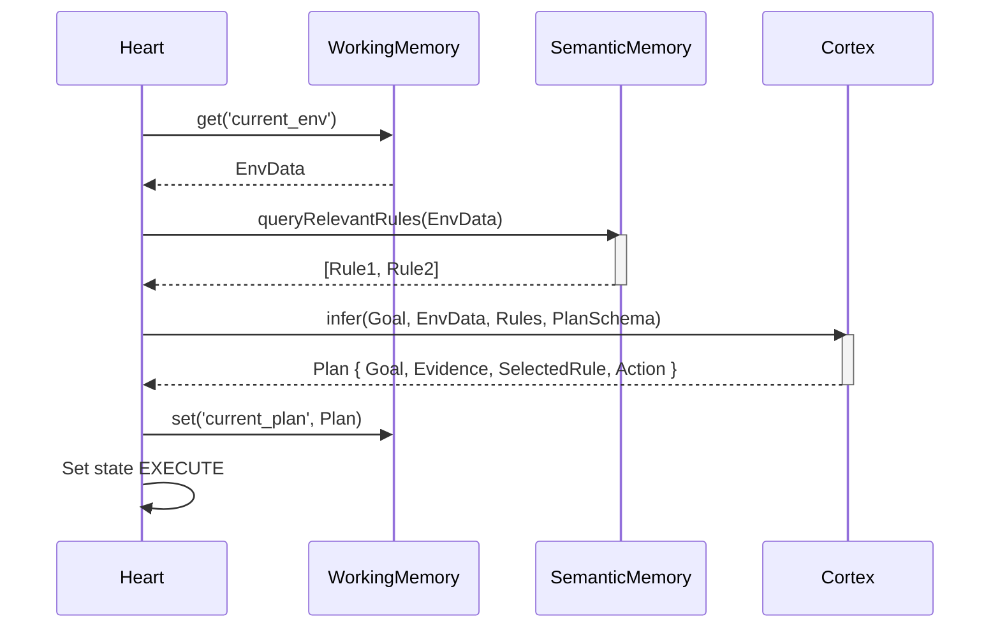

# Decision Making Flow

**Status:** `Stable` (Gen-1)

This flow occurs during the `THINK` state.

### Traceability
- **Implemented In:** `src/kernel/Heart.ts` -> `planExecution()` method.
- **Invariants:** The `Cortex` is strictly enforced to return a JSON object matching `PlanSchema`, ensuring deterministic evidence-logging before execution.
