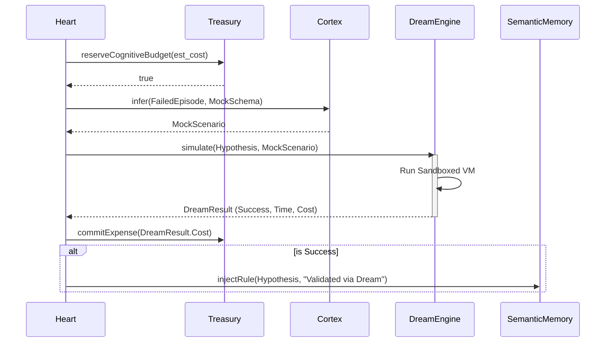

# Dream Cycle Flow

**Status:** `Stable` (Gen-1)

This flow occurs during `SLEEP` when a previous episode failed and requires simulation.

### Traceability
- **Implemented In:** `src/cognitive/DreamEngine.ts` and `src/kernel/Heart.ts`.
- **Invariants:** The `DreamEngine` must strictly timeout and kill the VM if it hangs. `Treasury` deductions must happen regardless of success or failure.
