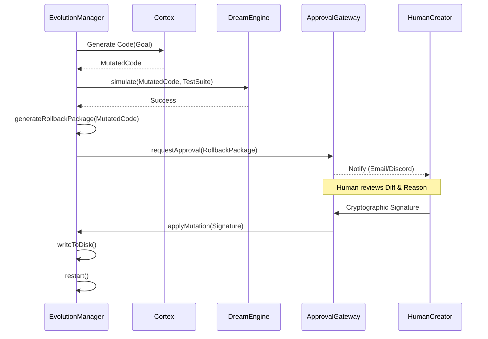

# Evolution Pipeline Flow

**Status:** `Experimental` (Gen-1)

This flow is triggered when the organism identifies a structural bottleneck and proposes a codebase mutation.

### Traceability
- **Implemented In:** `src/evolution/EvolutionManager.ts` and `src/evolution/ApprovalGateway.ts`.
- **Invariants:** Execution permanently blocks at `requestApproval` until the cryptographic signature is received. A `RollbackPackage` must exist before the request is sent.
