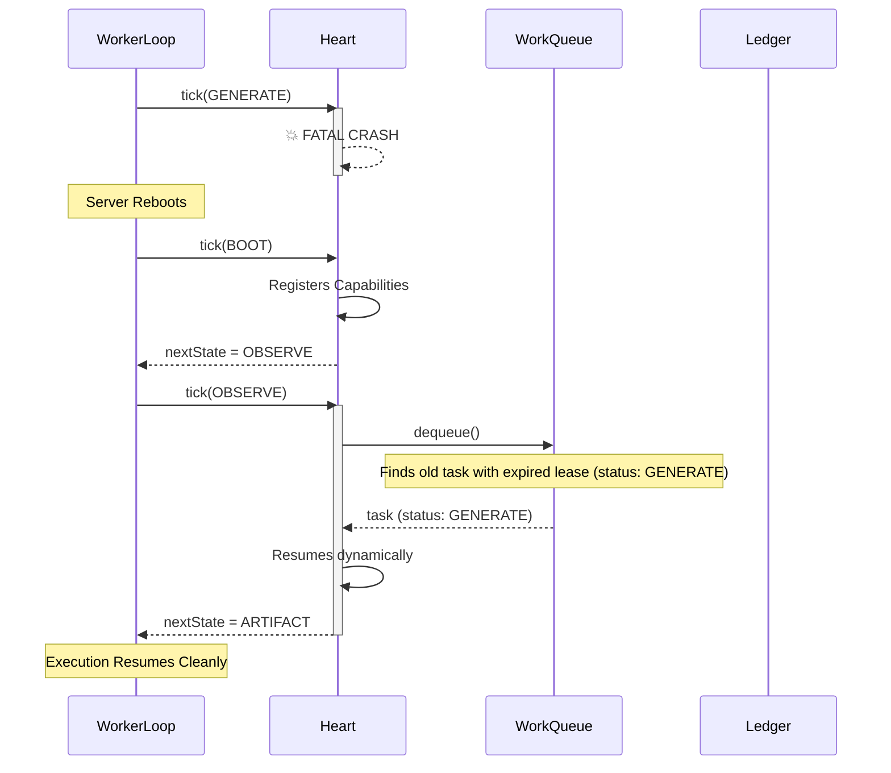

# Failure Recovery Flow

**Status:** `Stable` (Gen-1)

This flow demonstrates how the organism handles mid-execution catastrophic crashes (e.g. power failure, Out of Memory, fatal exception) without losing tasks or double-spending.

### Traceability
- **Implemented In:** `src/execution/WorkQueue.ts` and `src/kernel/Heart.ts`.
- **Invariants:** 
  1. `WorkQueue.dequeue()` MUST fetch any active task where `lease_expiry < now`, not just `QUEUED` tasks.
  2. `Heart.ts` `OBSERVE` state MUST dynamically map the task's database status back to the equivalent `OrganismState` to resume without re-planning.
