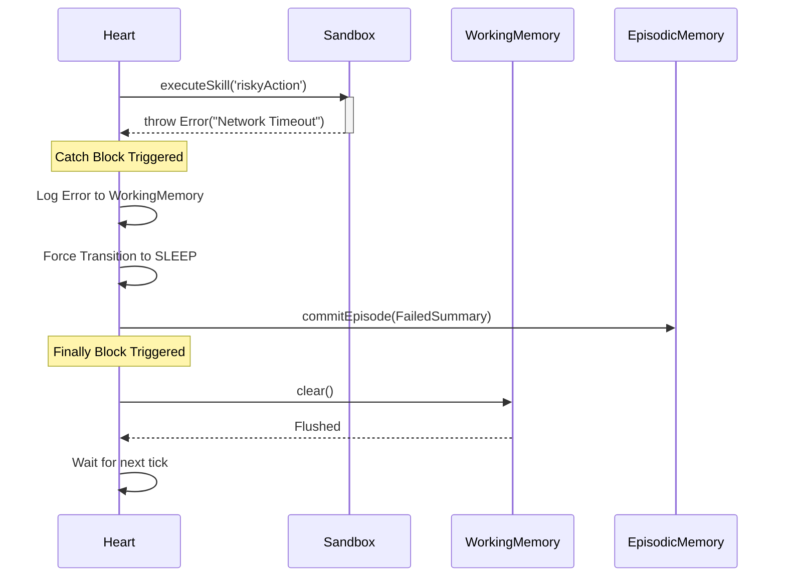

# Failure Recovery Flow

**Status:** `Stable` (Gen-1)

This flow demonstrates how the organism handles a mid-tick catastrophic failure without corrupting state.

### Traceability
- **Implemented In:** `src/kernel/Heart.ts`.
- **Invariants:** `WorkingMemory` MUST be cleared via the `finally` block to prevent the corrupted state from leaking into the next pulse.
