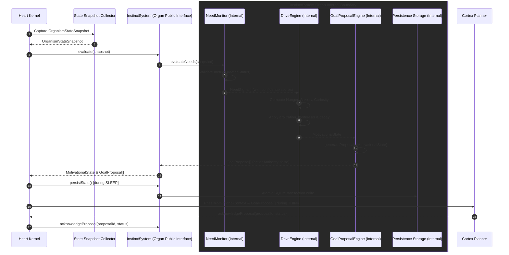

# Instinct Evaluation Flow

**Status:** Independently verified with limitation; RC1 evidence pending  
**Document:** `FLOWS/INSTINCT_EVALUATION_FLOW.md`  
**ADR:** `DECISIONS/ADR-008-GEN2-DRIVE-ARCHITECTURE.md`

---

## Sequence Diagram

---

## Detailed Step-by-Step Lifecycle

1. **Pulse Trigger & Snapshot Intake (`Heart`):**
   At each biological tick, `Heart` invokes state collectors across organs (`Treasury`, `Reliability`, `Workload`) to capture a single, versioned `OrganismStateSnapshot`.

2. **Organ Boundary Invocation (`InstinctSystem.evaluate`):**
   `Heart` calls `InstinctSystem.evaluate(snapshot)` via the public organ interface. `Heart` does NOT interact directly with internal components or storage.

3. **Internal Need Evaluation (`NeedMonitor`):**
   Inside the `InstinctSystem` boundary, `NeedMonitor` evaluates raw metrics from the snapshot. Each metric is assigned a `MetricStatus` (`VALID` | `STALE` | `DEGRADED` | `UNKNOWN` | `UNAVAILABLE`). Outputs `NeedSignal[]` with deterministic confidence scores.

4. **Internal Drive Computation & Arbitration (`DriveEngine`):**
   Inside the `InstinctSystem` boundary, `DriveEngine` computes Hunger, Anxiety, Curiosity, applies arbitration rules (e.g. Anxiety suppresses Curiosity), hysteresis thresholds, decay rates, and produces `MotivationalState`.

5. **Internal Proposal Generation (`GoalProposalEngine`):**
   If confidence = 1.0, `GoalProposalEngine` generates proposals for all otherwise policy-eligible classes. If confidence is $0.50–0.99$, it permits ONLY low-risk internal/read-only proposals. Normal proposal generation remains subject to inherited policy and authority boundaries. If confidence $< 0.50$, proposal generation is completely disabled.

6. **Organ Return & Persistence (`InstinctSystem.persistState`):**
   `InstinctSystem` returns an `InstinctEvaluationResult` containing `MotivationalState` and `GoalProposal[]` to `Heart`. During `SLEEP`, `Heart` triggers `InstinctSystem.persistState()`, which executes an atomic SQLite transaction write inside `InstinctSystem`.

7. **Advisory Context Exposure (`Cortex`):**
   `Heart` passes read-only `MotivationalContext` and `GoalProposal[]` to `Cortex` during `THINK`. `Cortex` uses this advisory context for plan priority scoring while independently enforcing all policy, treasury, and approval constraints.

8. **Proposal Acknowledgement (`Heart` pass-through):**
   `Cortex` acknowledges accepted or rejected proposals. `Heart` blindly forwards this acknowledgement to `InstinctSystem.acknowledgeProposal()`. `InstinctSystem` exclusively owns updating the proposal state in its internal storage, preventing `Heart` from acquiring proposal-policy authority.
