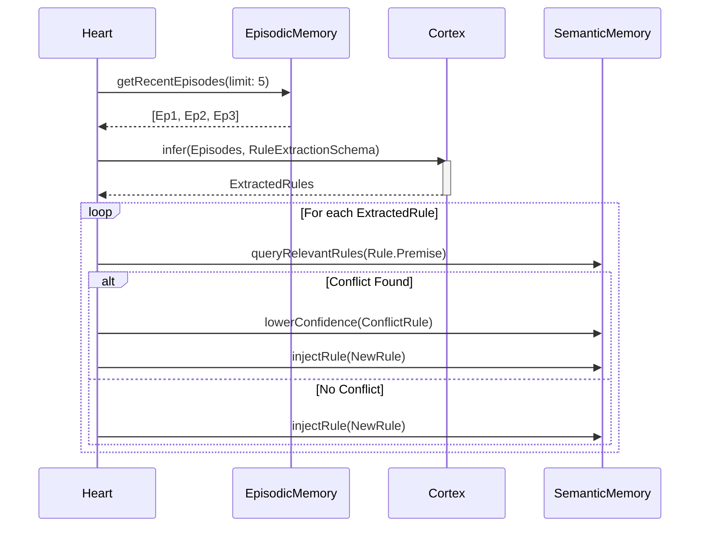

# Learning Cycle Flow

**Status:** `Stable` (Gen-1)

This flow occurs during `SLEEP` via the `ReflectionEngine`, extracting abstract semantic rules from recent episodes.

### Traceability
- **Implemented In:** `src/cognitive/ReflectionEngine.ts`.
- **Invariants:** Rule extraction must always link the new rule to the `episode_id` that justified it (Evidence).
