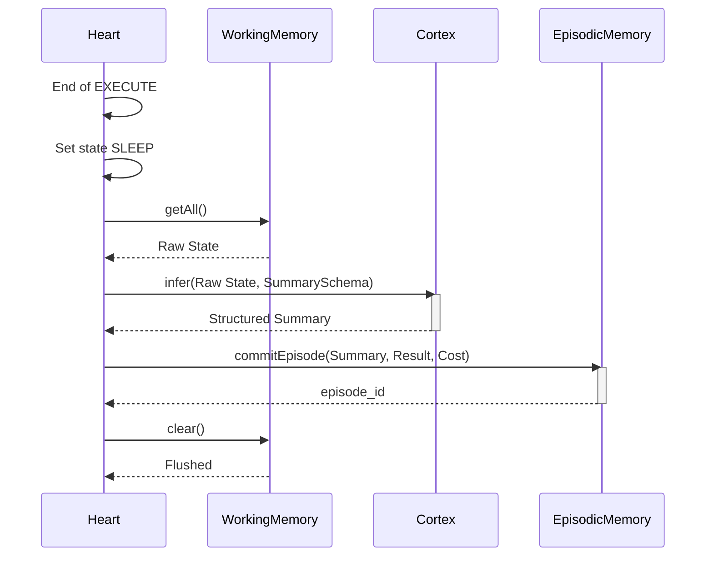

# Memory Formation Flow

**Status:** `Stable` (Gen-1)

This flow occurs during the transition from `EXECUTE` to `SLEEP`.

### Traceability
- **Implemented In:** `src/kernel/Heart.ts` -> `flushToEpisodic()` method.
- **Invariants:** `WorkingMemory` MUST be cleared even if `commitEpisode` throws an error.
