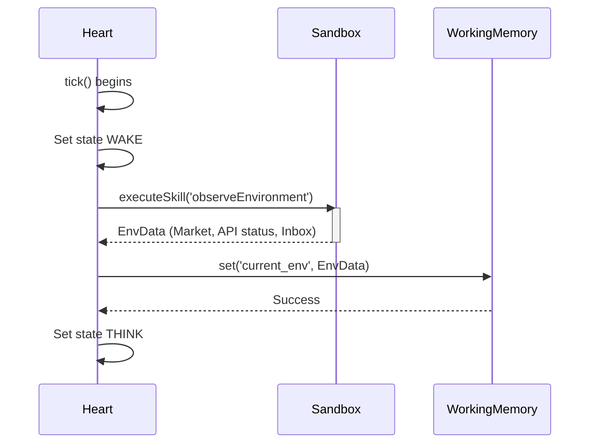

# Observation Flow

**Status:** `Stable` (Gen-0/Gen-1)

This flow occurs during the `WAKE` state. The organism observes its environment and populates `WorkingMemory`.

### Traceability
- **Implemented In:** `src/kernel/Heart.ts` -> `tick()` method.
- **Invariants:** If `observeEnvironment` fails, the organism logs the failure and transitions directly to `SLEEP`.
