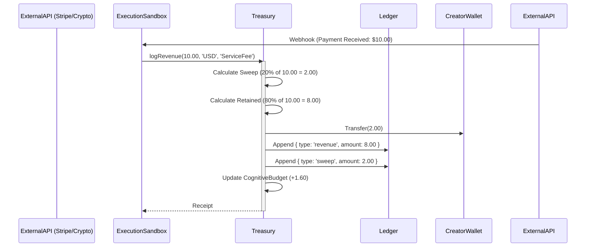

# Revenue Flow

**Status:** `Stable` (Gen-1)

This flow illustrates the organism's metabolic intake and the strict enforcement of the 20% Creator sweep.

### Traceability
- **Implemented In:** `src/economy/Treasury.ts`.
- **Invariants:** The 20% sweep is non-negotiable. The `CognitiveBudget` is updated based on the *retained* revenue (20% of the retained 80%, meaning 16% of gross).
